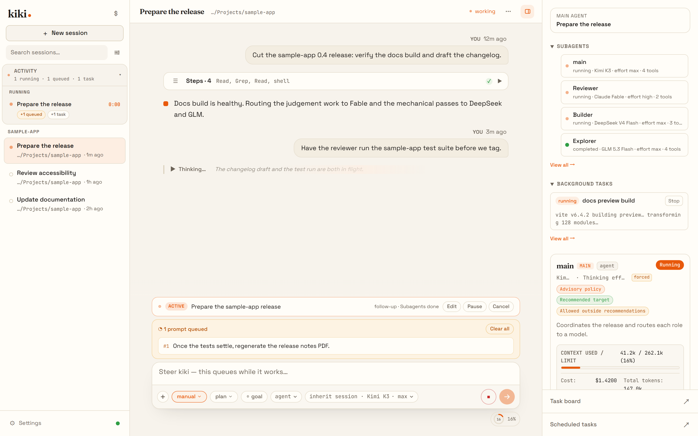
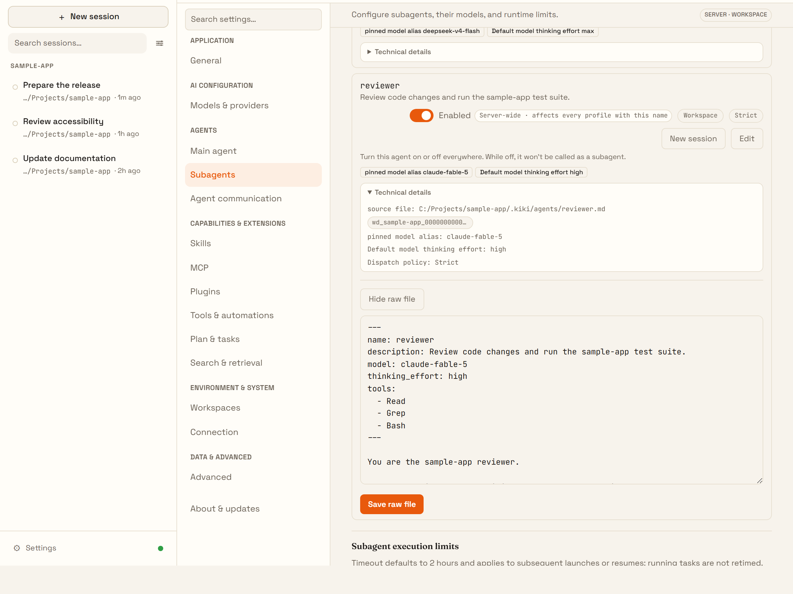
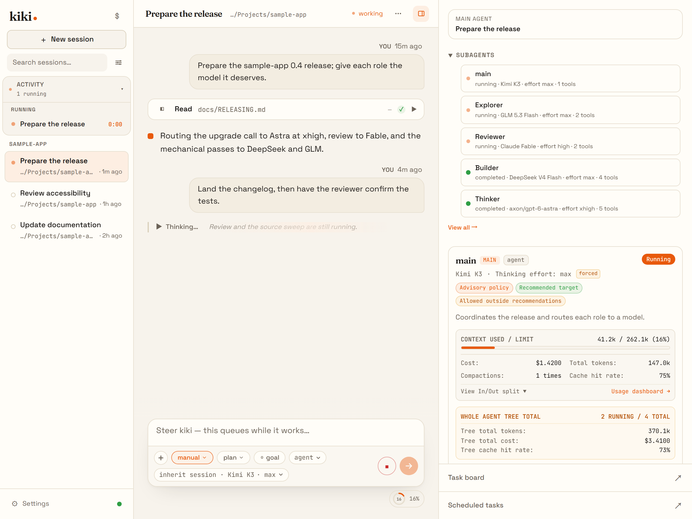
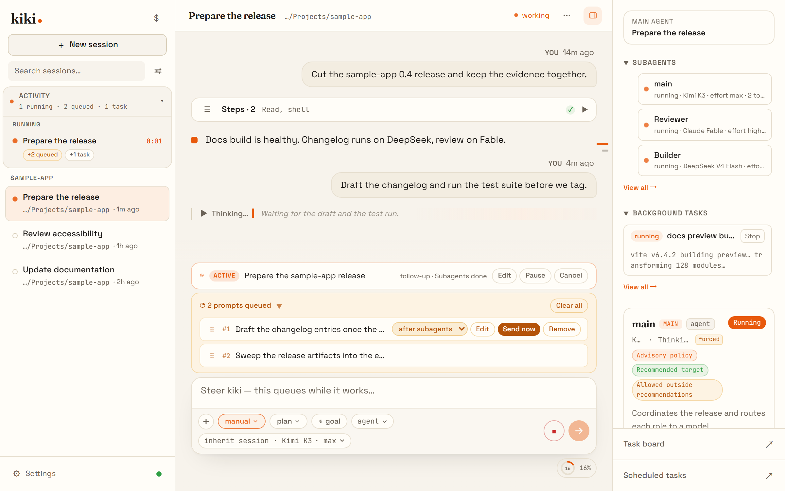
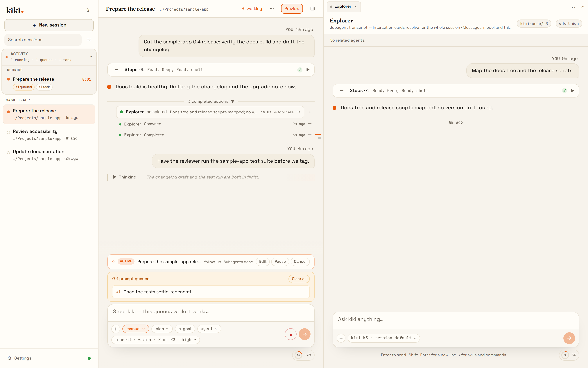

# Kiki

**Agents as profiles. Fleets under your control.**

[](LICENSE) [](https://x-t-e-r.github.io/kiki/en/) <br>
[Documentation](https://x-t-e-r.github.io/kiki/en/) · [Issues](https://github.com/X-T-E-R/kiki/issues) · [中文](README.zh-CN.md)

Kiki is a local agent workspace where every agent — the main one and each subagent — is a single Markdown file you own. Kiki runs them, teams them, and keeps the whole fleet visible while they work. It ships in three forms that share one daemon and one session store: a desktop app, a terminal CLI/TUI, and a browser UI. Kimi models work out of the box; other compatible providers can be configured.

No cloud relay. No agent lock-in. No black-box prompts.

**Spotlights:** [nb-search — web access with real key management](marketing/nb-search.en.md) · [Task board — work you can point at](marketing/task-board.en.md) · [Screenshot tour](marketing/gallery.en.md)



*Example scene rendered by the real Kiki UI; not a measured model-performance demo.*

Kiki began as a fork of [Kimi Code](https://github.com/MoonshotAI/kimi-code) and is now developed independently.

## Why Kiki

**Own the agent.** A Kiki agent is one Markdown file: the frontmatter declares its tools, model binding, and dispatch rules; the body *is* its system prompt. Profiles hot-reload in ~200 ms, can be edited from the settings UI or any text editor, and are portable — your existing Claude Code or OpenCode agent files load as-is. And every built-in prompt is overridable down to individual tool descriptions: globally, per model, or per profile, with `kiki prompt-fields` to inspect and validate exactly what the model will see.



**Run the fleet.** Dispatch subagents into isolated contexts with **per-role model bindings** — let a frontier model think, let fast models execute, and keep the reviewer's context separate from the implementer's by construction. Detach long work into background tasks; queue messages while the agent is busy, with per-message timing; pin a `/goal` the agent pursues across turns; schedule cron prompts into sessions; track work on the per-workspace task board.



**A real agent toolchain.** The agent operates the same surface you do: `AgentRun` / `AgentSend` / `AgentList` to dispatch and message subagents, `ThreadCreate` to open an entirely new conversation thread with its own workspace, `CronCreate` to schedule future work, `CreateGoal` to pin a long-running objective, and `TaskList` / `TaskOutput` / `TaskStop` to supervise what is already running. Orchestration is something the agent *does*, not something you wire up.



**See everything.** The agent panel shows the live dispatch tree — who is running, who is done, what came back — and the transcript folds tool-step groups out of your way. Completion notices, questions, and approvals are first-class UI, not log lines you have to tail.



## Feature highlights

- **Three forms, one workspace.** Desktop app, terminal TUI, and browser UI share the same daemon, sessions, and configuration — switch freely, or drive a session from Zed/JetBrains over [ACP](https://agentclientprotocol.com/).
- **Video input.** Drop a screen recording or demo clip into the chat and let the agent watch what is hard to describe in words.
- **AI-native MCP configuration.** Add, edit, and authenticate MCP servers conversationally with `/kiki-ops`, without hand-editing JSON.
- **Plugin ecosystem.** Install skills, MCP servers, and data sources from the marketplace or any GitHub repo, with each install's trust level surfaced up front.
- **Lifecycle hooks.** Run local commands at key points to gate risky tool calls, audit decisions, trigger desktop notifications, or connect your own automation.
- **Provider and model management.** Configure providers, models, and thinking effort from the settings UI; credentials stay in local files you can inspect.

## Install

Choose a build from [GitHub Releases](https://github.com/X-T-E-R/kiki/releases) under `kiki-v<version>`:

| Platform | Desktop app | Standalone CLI/TUI |
| --- | --- | --- |
| Windows x64 | `Kiki_*_x64-setup.exe` (also installs `kiki` on your user `PATH`) | Included in the installer; no separate Windows CLI asset |
| Linux x64 | `Kiki_*_amd64.deb` (adds `kiki` to `PATH`) or `Kiki_*_amd64.AppImage` | `kiki-linux-x64` |
| Linux ARM64 | — | `kiki-linux-arm64` |
| macOS Apple Silicon | `Kiki_*_aarch64.dmg` | `kiki-darwin-arm64` |
| macOS Intel | `Kiki_*_x64.dmg` | `kiki-darwin-x64` |

Standalone CLI files have matching `.sha256` checksums. On macOS, the dmg is unsigned and not notarized: verify the download, drag Kiki to Applications, then use **Control-click → Open** on first launch. Add the CLI to your `PATH` separately; the dmg does not change it.

Alternatively, with Node.js 24.15.0+ install the CLI/TUI and desktop with `npm install -g kiki-agent`, or only the CLI/TUI with `npm install -g kiki-agent-lite`. The full npm package downloads and checksum-verifies the matching desktop release at install time; it requires network access. Run `kiki desktop` to open the installed app (or get installation instructions if it is absent).

> On Windows, install [Git for Windows](https://gitforwindows.org/) before first launch because the Kiki CLI uses the bundled Git Bash as its shell environment. If Git Bash is installed in a custom location, set `KIKI_SHELL_PATH` to the absolute path of `bash.exe`.

In a new terminal session, verify with `kiki --version`. See [Installation](https://x-t-e-r.github.io/kiki/en/getting-started/installation) for checksum commands, permissions, and update channels.

## Quick Start

Open a project and start the interactive UI:

```sh
cd your-project
kiki        # terminal UI
kiki web    # browser UI
```

On first launch, run `/login` and choose either Kimi Code OAuth or a Moonshot AI Open Platform API key. After login, try your first task:

```
Take a look at this project and explain its main directories.
```

## Use it in your editor (ACP)

Kiki speaks the [Agent Client Protocol](https://agentclientprotocol.com/), so ACP-compatible editors and IDEs (Zed, JetBrains, …) can drive a session over stdio. Log in once, then point your editor at the `kiki acp` subcommand — no extra login needed.

For Zed, add this to `~/.config/zed/settings.json`:

```json
{
  "agent_servers": {
    "Kiki": {
      "type": "custom",
      "command": "kiki",
      "args": ["acp"],
      "env": {}
    }
  }
}
```

Then open a new conversation in Zed's Agent panel. See the [ACP guide](https://x-t-e-r.github.io/kiki/en/server/acp) for JetBrains setup and troubleshooting.

## Docs

- [Installation](https://x-t-e-r.github.io/kiki/en/getting-started/installation)
- [First launch](https://x-t-e-r.github.io/kiki/en/getting-started/first-launch)
- [Desktop app](https://x-t-e-r.github.io/kiki/en/getting-started/desktop-app)
- [Agent profiles](https://x-t-e-r.github.io/kiki/en/customization/agent-profiles)
- [Prompt field overrides](https://x-t-e-r.github.io/kiki/en/customization/prompt-fields)
- [Interaction and approvals](https://x-t-e-r.github.io/kiki/en/guides/interaction)
- [Configuration](https://x-t-e-r.github.io/kiki/en/configuration/config-files)
- [Command reference](https://x-t-e-r.github.io/kiki/en/reference/command)

## Develop

Requirements: Node.js ≥ 24.15.0, pnpm 10.33.0.

```sh
git clone https://github.com/X-T-E-R/kiki.git
cd kiki
pnpm install
```

```sh
pnpm dev:cli    # run the CLI in dev mode
pnpm test       # run tests
pnpm typecheck  # TypeScript check
pnpm lint       # oxlint
pnpm build      # build all packages
```

See [CONTRIBUTING.md](CONTRIBUTING.md) for the full contribution guide.

## Community

- [Issues](https://github.com/X-T-E-R/kiki/issues)
- For security vulnerabilities, see [SECURITY.md](SECURITY.md).

## Acknowledgements

Kiki's TUI is built on top of [`pi-tui`](https://github.com/earendil-works/pi-mono/tree/main/packages/tui), and the project began as a fork of [Kimi Code](https://github.com/MoonshotAI/kimi-code). We thank the authors of both for their valuable work.

## License

Released under the [MIT License](LICENSE).
