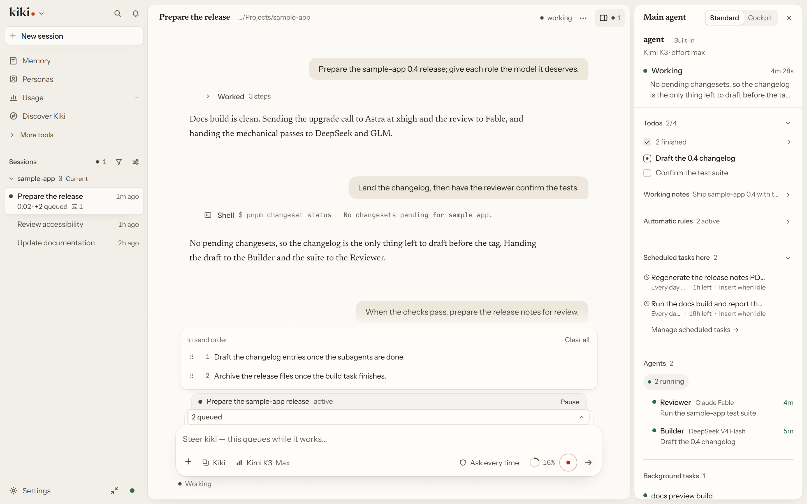
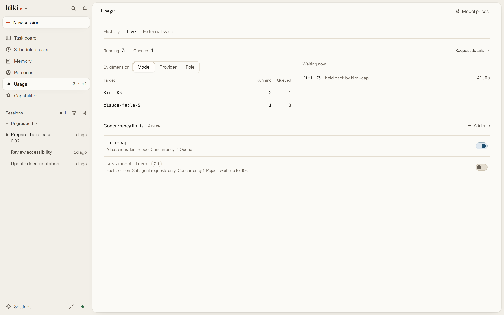
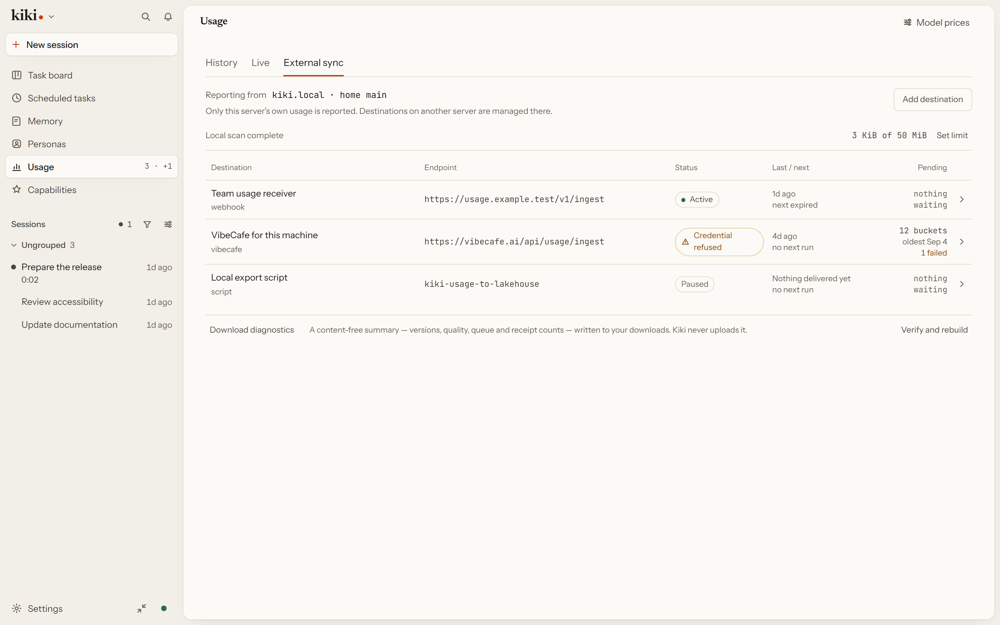

# Kiki

**Agents that answer to you.**

[](LICENSE) [](https://x-t-e-r.github.io/kiki/en/) <br>
[Documentation](https://x-t-e-r.github.io/kiki/en/) · [All features](https://x-t-e-r.github.io/kiki/en/features/) · [Screenshot tour](marketing/gallery.en.md) · [Issues](https://github.com/X-T-E-R/kiki/issues) · [Acknowledgements](ACKNOWLEDGEMENTS.md) · [中文](README.zh-CN.md)

Kiki is an open-source AI agent workbench that runs on your machine. The desktop app, the terminal UI, and the browser UI all connect to one local daemon, so a session you start in one is the same session you open in another.



## Start here

```sh
npm install -g kiki-agent   # needs Node.js 24.15.0+; a desktop build is linked below
cd your-project
kiki                        # terminal UI; `kiki web` for the browser, `kiki desktop` for the app
```

Run `/login` and pick Kimi Code OAuth or a Kimi Platform API key — other providers are in [Providers and models](https://x-t-e-r.github.io/kiki/en/configuration/providers). Then ask for something:

```
Take a look at this project and explain its main directories.
```

New sessions start in Auto mode: routine work runs on its own, and you are still asked before it touches sensitive files or runs dangerous commands. `/permission` switches among Manual, Auto, Review, and YOLO.

## Install a desktop build

Pick a build from [GitHub Releases](https://github.com/X-T-E-R/kiki/releases) under `kiki-v<version>`:

| Platform | Desktop app | Standalone CLI/TUI |
| --- | --- | --- |
| Windows x64 | `Kiki_*_x64-setup.exe` (also installs `kiki` on your user `PATH`) | Included in the installer; no separate Windows CLI asset |
| Linux x64 | `Kiki_*_amd64.deb` (adds `kiki` to `PATH`) or `Kiki_*_amd64.AppImage` | `kiki-linux-x64` |
| Linux ARM64 | — | `kiki-linux-arm64` |
| macOS Apple Silicon | `Kiki_*_aarch64.dmg` | `kiki-darwin-arm64` |
| macOS Intel | `Kiki_*_x64.dmg` | `kiki-darwin-x64` |

Each standalone CLI file comes with a matching `.sha256` checksum. On macOS the dmg is unsigned and not notarized: verify the download, drag Kiki to Applications, and use **Control-click → Open** on first launch; the dmg does not change your `PATH`, so add the CLI separately.

With npm, `kiki-agent` installs the CLI/TUI and downloads and checksum-verifies the matching desktop release (network required), while `kiki-agent-lite` installs only the CLI/TUI. `kiki desktop` opens the installed app.

> On Windows, install [Git for Windows](https://gitforwindows.org/) before first launch — the Kiki CLI uses the bundled Git Bash as its shell environment. If Git Bash is installed elsewhere, set `KIKI_SHELL_PATH` to the absolute path of `bash.exe`.

Verify with `kiki --version`. See [Installation](https://x-t-e-r.github.io/kiki/en/getting-started/installation) for checksum commands and update channels.

## Give every role its own model

The lead agent splits your task and dispatches subagents, and each one can run a different model — or a different vendor — in the same session. A strong reasoning model can plan while cheaper models do the routine work, and a review by a different vendor is not anchored to the same blind spots as the implementation. Kimi works out of the box; Anthropic, OpenAI-compatible services, the OpenAI Responses API, Gemini, and Vertex AI can be added, and you can sign in with a GitHub Copilot or ChatGPT account.


Agents themselves are Markdown files you own: the frontmatter sets tools, model, effort, and which agents it may dispatch, and the body is the system prompt. Kiki watches those folders and reloads edits in about 200 ms. You can build one by copying an existing profile, from a shipped template, or blank — no need to hand-write a file first. When you start a session you can also pick a git worktree, so that session's work lands on its own branch instead of your checkout.

Open any dispatched subagent to read its own transcript, and message it from its own composer. Long commands move to the background and notify the agent when they finish, so it never has to poll. See [One workbench, many lines](https://x-t-e-r.github.io/kiki/en/features/workbench) and [Agents and Sub-Agents](https://x-t-e-r.github.io/kiki/en/customization/agents).

## Keep work going past the session

A goal keeps the target in view across turns instead of restating the task each time. While the agent works, what you type joins a queue rather than cutting in, and each queued message can go out when the agent is idle, after its subagents finish, or after its background tasks finish.

Memory is what outlives the session: preferences, feedback, verified project facts, and references, kept as global, per workspace, or per persona. You can read every entry, and undo any change one operation at a time — including a delete. Set approval to `review` and proposed writes wait in an inbox instead of applying themselves. See the [memory guide](https://x-t-e-r.github.io/kiki/en/guides/memory).

Each workspace also has a board where requirements are cards that link to the sessions working on them, and the agent reads and updates it. Scheduled prompts cover the recurring case: a prompt fires on a cron schedule while a Kiki process holds that session open. See [Work that runs long](https://x-t-e-r.github.io/kiki/en/features/long-work).

## Know what it costs, and where the numbers go

The **Usage** page is one page with three tabs, because those are three different moments.

**History** breaks a date range into tokens, cost, and cache hit rate, with separate completeness indicators — a provider that never returned usage reads as unknown rather than as a real zero — and ranks sessions by cost so the expensive one is the first row. Every filter rides the URL, so a view you settled on is a link you can paste.

**Live** shows what this service is running and holding, and names the concurrency rule holding each waiting request, with that same rule editable right below. The cap counts requests, not money, and it governs the model requests this Kiki sends itself: hand a turn to Codex, Claude Code, or Grok Build as the engine and those requests are the engine's own, outside these rules.

**External sync** sends the numbers to a webhook you control, a VibeCafe account, or a script you approve — model, UTC half-hour, four token counts, quality, and a local cost estimate, never a prompt, answer, title, or path. A script runs as your own OS user, so it is not a sandbox. No usage batches are sent until you add a destination, preview the exact payload, agree once, and enable it.





See [The daily driver](https://x-t-e-r.github.io/kiki/en/features/daily) and [`kiki usage-export`](https://x-t-e-r.github.io/kiki/en/reference/command#kiki-usage-export).

## Roles you can talk to

A **persona** is a long-term identity — a name, an avatar, what it is for, the standing rules for how it works, and its own memory — stored as a Markdown file you can read and edit. Clicking its name lands you in the same conversation every time, so "ask Lin Lan" means one thing; the same persona can hold several conversations at once for different projects.

A **room** puts two to six of them on one topic, speaking in order, with a host, a budget, and pause and continue.

A persona is not a profile. A profile is execution configuration — tools, permissions, model, effort; a persona is identity — who it is and what it remembers. Rebinding one does not touch the other. See [Roles you can talk to](https://x-t-e-r.github.io/kiki/en/features/people).


## Your data, your machines

A **space** is a Kiki you open, with its own shortcuts, window behavior, and credential scope — shared with the main space or isolated — so a work Kiki and a personal Kiki can sit side by side without sharing what they sign in to.

**Remote connections** point one Kiki home at another with an approval on each side, and every connection is one row with its own state. A **thread bridge** is narrower: a one-way channel for messages between two homes that never grants browsing access. **Web access** opens this Kiki in a browser on another device through a single-use link, and turning it off revokes every link without stopping work already running. **SSH hosts** joined to a session belong to that session, so the timeline stays clean. See [Your data, your machines](https://x-t-e-r.github.io/kiki/en/features/spaces).

## Work in the window you have open

Finished stretches of tool calls, thinking, and shell output fold into one line such as "Worked · 8 steps", and every fold opens back up in order. The right rail shows pending approvals and questions, what the agent is doing now, context and cost, its working notes, the agent team, and background tasks — and it follows you into a subagent. Annotations let you leave a note on a message and send it with your next one instead of interrupting with a separate turn.

Temporary conversations stay out of history, search, and memory, and are deleted when they end. The agent can search its own earlier messages and tool output — including text from before a compaction — with `HistorySearch` and `HistoryRead`, and you can search sessions by title in the sidebar. Web search and fetch run on named lanes you can inspect; GitHub repository search works without a key. Appearance is six built-in skins, picture and video backgrounds, and appearance packs that bundle colors with media. See [The daily driver](https://x-t-e-r.github.io/kiki/en/features/daily) and [Look and feel](https://x-t-e-r.github.io/kiki/en/features/look).

## Bring in history, plug in other tools

A plugin can add skills, agents, MCP servers, hooks, commands, and tools; browse and install them on the Capabilities page, and the official marketplace includes Kiki Office Suite and Kiki Writing. Sessions stay on your machine — there is no cloud relay.

Any built-in prompt field can be replaced, down to a single tool description, globally or per model or agent, and `kiki prompt-fields` shows what the model will receive. Import another tool's conversations as Kiki sessions you can keep working in, or as read-only archives; the preview tells you what is kept and what is not, and nothing is installed or trusted to reach it. `kiki acp` puts Kiki inside Zed, JetBrains, and other ACP clients, and `kiki seat` lets Cursor, Claude Code, or Codex call it as a service with the workspace, permission mode, and model fixed before they connect. An agent profile can also run on another harness entirely as its engine. See [Bring your history, meet other tools](https://x-t-e-r.github.io/kiki/en/features/ecosystem) and [Every layer is yours](https://x-t-e-r.github.io/kiki/en/features/freedom).

## Docs

[All features](https://x-t-e-r.github.io/kiki/en/features/) · [First launch](https://x-t-e-r.github.io/kiki/en/getting-started/first-launch) · [Desktop app](https://x-t-e-r.github.io/kiki/en/getting-started/desktop-app) · [Agent profiles](https://x-t-e-r.github.io/kiki/en/customization/agent-profiles) · [Plugins](https://x-t-e-r.github.io/kiki/en/customization/plugins) · [Interaction and approvals](https://x-t-e-r.github.io/kiki/en/guides/interaction) · [Configuration](https://x-t-e-r.github.io/kiki/en/configuration/config-files) · [Command reference](https://x-t-e-r.github.io/kiki/en/reference/command) · [Tool reference](https://x-t-e-r.github.io/kiki/en/reference/tools)

## Develop

Requirements: Node.js ≥ 24.15.0, pnpm 10.33.0.

```sh
git clone https://github.com/X-T-E-R/kiki.git && cd kiki && pnpm install
pnpm dev:cli    # run the CLI in dev mode
pnpm test       # tests  ·  pnpm typecheck  ·  pnpm lint  ·  pnpm build
```

See [CONTRIBUTING.md](CONTRIBUTING.md) for the full guide. Report bugs in [Issues](https://github.com/X-T-E-R/kiki/issues); for security vulnerabilities, see [SECURITY.md](SECURITY.md).

## Acknowledgements

Kiki began as a fork of [Kimi Code](https://github.com/MoonshotAI/kimi-code) and is now developed independently. Its TUI is built on [`pi-tui`](https://github.com/earendil-works/pi-mono/tree/main/packages/tui). The desktop app adapts code and interaction patterns from several other open-source projects. [ACKNOWLEDGEMENTS.md](ACKNOWLEDGEMENTS.md) lists each project, what Kiki took from it, and its license.

## License

Released under the [MIT License](LICENSE).
