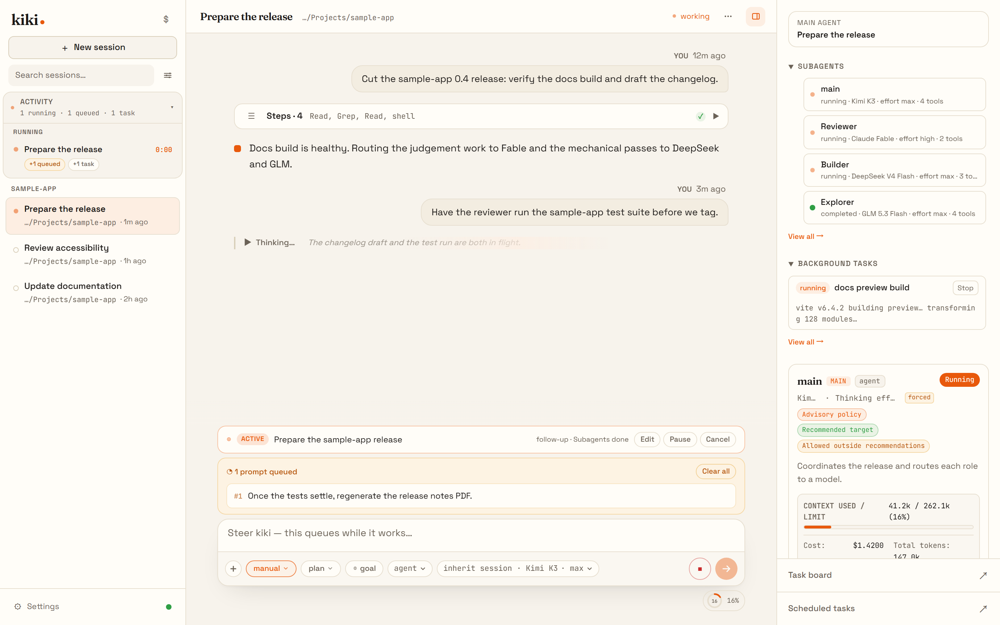
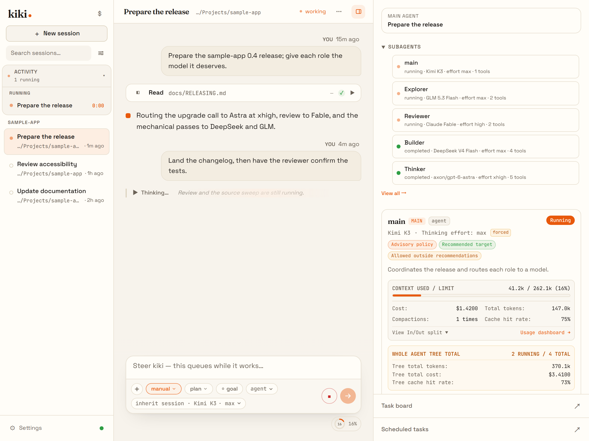
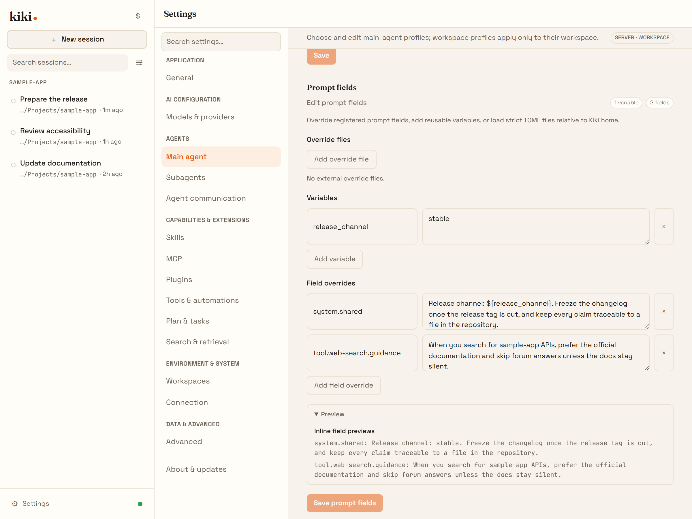

# Kiki

**Agents that answer to you.**

[](LICENSE) [](https://x-t-e-r.github.io/kiki/en/) <br>
[Documentation](https://x-t-e-r.github.io/kiki/en/) · [All features](marketing/features.en.md) · [Screenshot tour](marketing/gallery.en.md) · [Issues](https://github.com/X-T-E-R/kiki/issues) · [Acknowledgements](ACKNOWLEDGEMENTS.md) · [中文](README.zh-CN.md)

Kiki is an open-source AI agent workbench that runs on your machine. The desktop app, the terminal UI, and the browser UI all connect to one local daemon, so every session is available from each of them.

What people use it for:

- Handing a coding or research task to a lead agent that splits it across subagents, each running the model you chose for that role.
- Keeping long work moving: goals that carry across turns, a queue for what you type while the agent is busy, scheduled prompts, and a task board for each workspace.
- Controlling exactly what each agent sees, from its tools and model down to the wording of a single tool description.

<!-- Hero: replace with the real screen recording of a lead session (marketing/launch/demo-storyboard.md) once it is recorded. -->


*Example scene rendered by the real Kiki UI; not a measured model-performance demo. A real screen recording will replace it.*

## Quick start

```sh
npm install -g kiki-agent   # Node.js 24.15.0+; or grab a desktop build below
cd your-project
kiki                        # terminal UI; `kiki web` for the browser, `kiki desktop` for the app
```

Run `/login` and choose Kimi Code OAuth or a Kimi Platform API key. For other providers, see [Providers and models](https://x-t-e-r.github.io/kiki/en/configuration/providers). Then ask:

```
Take a look at this project and explain its main directories.
```

New sessions start in Auto mode, which runs routine work on its own and still asks before it touches sensitive files or runs dangerous commands. Use `/permission` to switch between Manual, Auto, Review, and YOLO. On Windows, install Git for Windows first (see below).

## Install

Choose a build from [GitHub Releases](https://github.com/X-T-E-R/kiki/releases) under `kiki-v<version>`:

| Platform | Desktop app | Standalone CLI/TUI |
| --- | --- | --- |
| Windows x64 | `Kiki_*_x64-setup.exe` (also installs `kiki` on your user `PATH`) | Included in the installer; no separate Windows CLI asset |
| Linux x64 | `Kiki_*_amd64.deb` (adds `kiki` to `PATH`) or `Kiki_*_amd64.AppImage` | `kiki-linux-x64` |
| Linux ARM64 | — | `kiki-linux-arm64` |
| macOS Apple Silicon | `Kiki_*_aarch64.dmg` | `kiki-darwin-arm64` |
| macOS Intel | `Kiki_*_x64.dmg` | `kiki-darwin-x64` |

Each standalone CLI file comes with a matching `.sha256` checksum. On macOS, the dmg is unsigned and not notarized: verify the download, drag Kiki to Applications, then use **Control-click → Open** on first launch. The dmg does not change your `PATH`, so add the CLI to it separately.

With npm, `kiki-agent` installs the CLI/TUI and downloads and checksum-verifies the matching desktop release (network required); `kiki-agent-lite` installs only the CLI/TUI. `kiki desktop` opens the installed app, or explains how to get it.

> On Windows, install [Git for Windows](https://gitforwindows.org/) before first launch because the Kiki CLI uses the bundled Git Bash as its shell environment. If Git Bash is installed in a custom location, set `KIKI_SHELL_PATH` to the absolute path of `bash.exe`.

Verify with `kiki --version` in a new terminal. See [Installation](https://x-t-e-r.github.io/kiki/en/getting-started/installation) for checksum commands and update channels.

## Agents and models

- **Each role on its own model.** Bind the lead agent, each subagent, and the reviewer to different models, and mix vendors in one session. Kimi works out of the box. Anthropic, OpenAI-compatible services, the OpenAI Responses API, Gemini, and Vertex AI can be added, and you can sign in with a GitHub Copilot or ChatGPT account.
- **Agents are Markdown files you own.** The frontmatter sets tools, model, effort, and which agents it may dispatch; the body is the system prompt. Kiki watches the agent folders and reloads edits in about 200 ms. Frontmatter keys are closed, so a Claude Code or OpenCode agent file loads once you remove the keys Kiki doesn't know, such as Claude Code's `model` or OpenCode's `mode`.
- **Prompts down to one tool description.** Override any built-in prompt field globally, per model, or per agent. `kiki prompt-fields list | show | explain` shows what the model receives and which layer each value came from.
- **Subagents that report back.** The lead agent dispatches subagents, sends long commands to the background, and is notified when they finish, so it doesn't need to poll. You can open any subagent's transcript and message it from its own composer.
- **Isolated worktrees.** Pick a git worktree when you create a session, and its work lands on a separate branch instead of your checkout.
- **Other agents as engines.** An agent profile can run on Claude Code, Codex, Cursor, Gemini CLI, Kimi CLI, OpenCode, or Grok Build through ACP or the Codex app-server. Settings → External engines checks whether each one is installed and shows the setup steps that remain.



## Long-running work

- **Keep talking while it works.** Messages you send while the agent is busy wait in a queue. Each can go out when the agent is idle, after its subagents finish, or after its tasks finish, and you can reorder, edit, or send one right away.
- **Goals.** Start a message with `/goal` to get a goal card the agent keeps working toward across turns, with edit, pause, and cancel controls.
- **Scheduled prompts.** The agent can schedule a prompt once or on a cron expression. A global panel lists every schedule, and schedules run even when their session is closed.
- **A task board per workspace.** Requirements live as cards that link to the sessions working on them, and the agent reads and updates the board itself.
- **Context that lasts.** Automatic compaction can be set per model and per agent, the agent's working notes carry across compaction, and long sessions can switch to a fresh-context strategy.

## Finding things again

- **Session history for the agent.** `HistorySearch`, `HistoryRead`, and `HistoryList` let the agent search earlier messages and tool output, read an exact turn or step, and browse a session's turns, including text from before a compaction. By default they look at the current session and agent, and can be widened to the workspace.
- **Memory.** Memory is on by default. The agent saves user preferences, feedback, verified project facts, and reference pointers to a global or per-workspace store with `MemoryWrite`, and finds them again with `MemorySearch` and `MemoryRead`. Settings → Memory lets you review entries, require approval, or switch memory off for a workspace.
- **Search in the sidebar.** Session titles are always searchable. Full-text search over conversation content is available in the CLI server; in the bundled desktop app it is an experimental opt-in (Settings → Search & retrieval) because the first index build can take 20–30 minutes and needs at least 2 GB of free disk space.
- **Web search and fetch.** Search and page fetches run on named lanes you can inspect. GitHub repository search works without a key, and multiple keys for a provider rotate across calls.

## The desktop app

- **A timeline that stays readable.** Finished stretches of tool calls, thinking, and shell output fold into one line such as "Worked · 8 steps". The live turn and finished subagents fold the same way, image results keep a row of their own, and every fold opens back up in its original order.
- **A right rail for the agent in focus.** It shows pending approvals and questions, what the agent is doing now, context and cost, its todo list and working notes, the agent team, and background tasks. The same rail follows you into a subagent.
- **A composer that handles decisions.** When an approval or question is waiting, it takes over the composer card; your draft comes back intact. Notes, the goal, and the queue sit in the same card, and the Enter-key behavior is configurable.
- **Temporary conversations.** Start one from `/new`, the sidebar, or the header (or `kiki --ephemeral` in the terminal). It stays out of history, search, and memory, and is deleted when it ends.
- **A new-session page focused on the composer.** Pick the workspace, worktree, and agent, then type; the first message moves into the session view.
- **Settings you can find your way around.** About twenty pages from General to Labs, with search. The model picker shows each model's context size and auto-compaction point, and marks models without image input.
- **Appearance.** Built-in skins, picture and video backgrounds, and appearance packs that bundle colors with background media.

## Plugins and integrations

- **Plugins.** A plugin can add skills, agents, MCP servers, hooks, commands, tools, and sandboxed panels. Browse, install, and configure plugins on the Capabilities page. Claude Code plugins with a `.claude-plugin/plugin.json` manifest can be installed too. The official marketplace includes Kiki Office Suite (Word, Excel, and PowerPoint through OfficeCLI) and Kiki Writing.
- **IDEs over ACP.** `kiki acp` lets Zed, JetBrains, and other [ACP](https://agentclientprotocol.com/) clients drive Kiki sessions. See the [ACP guide](https://x-t-e-r.github.io/kiki/en/server/acp).
- **Your data stays local.** Sessions are stored on your machine and there is no cloud relay.



**[All features →](marketing/features.en.md)**

## Docs

[First launch](https://x-t-e-r.github.io/kiki/en/getting-started/first-launch) · [Desktop app](https://x-t-e-r.github.io/kiki/en/getting-started/desktop-app) · [Agent profiles](https://x-t-e-r.github.io/kiki/en/customization/agent-profiles) · [Prompt field overrides](https://x-t-e-r.github.io/kiki/en/customization/prompt-fields) · [Plugins](https://x-t-e-r.github.io/kiki/en/customization/plugins) · [Interaction and approvals](https://x-t-e-r.github.io/kiki/en/guides/interaction) · [Configuration](https://x-t-e-r.github.io/kiki/en/configuration/config-files) · [Command reference](https://x-t-e-r.github.io/kiki/en/reference/command) · [Tool reference](https://x-t-e-r.github.io/kiki/en/reference/tools)

## Develop

Requirements: Node.js ≥ 24.15.0, pnpm 10.33.0.

```sh
git clone https://github.com/X-T-E-R/kiki.git && cd kiki && pnpm install
pnpm dev:cli    # run the CLI in dev mode
pnpm test       # tests  ·  pnpm typecheck  ·  pnpm lint  ·  pnpm build
```

See [CONTRIBUTING.md](CONTRIBUTING.md) for the full guide. Report bugs in [Issues](https://github.com/X-T-E-R/kiki/issues); for security vulnerabilities, see [SECURITY.md](SECURITY.md).

## Acknowledgements

Kiki began as a fork of [Kimi Code](https://github.com/MoonshotAI/kimi-code) and is now developed independently. Its TUI is built on [`pi-tui`](https://github.com/earendil-works/pi-mono/tree/main/packages/tui). The desktop app adapts code and interaction patterns from several other open-source projects. [ACKNOWLEDGEMENTS.md](ACKNOWLEDGEMENTS.md) lists each project, what Kiki took from it, and its license.

## License

Released under the [MIT License](LICENSE).
