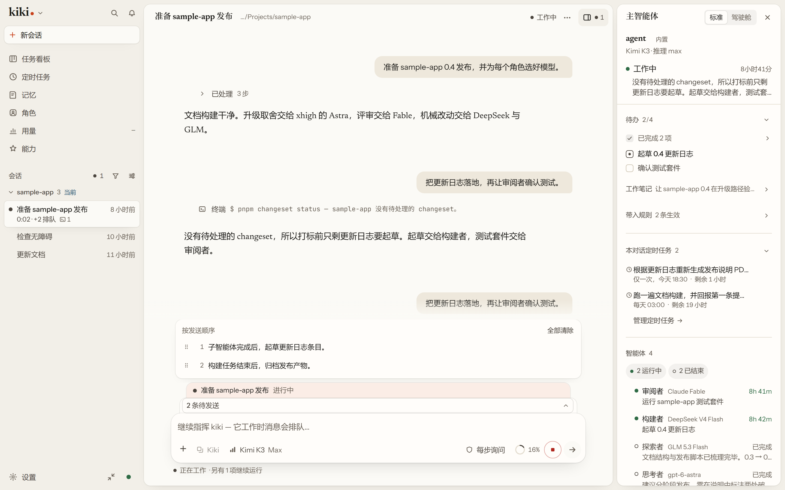
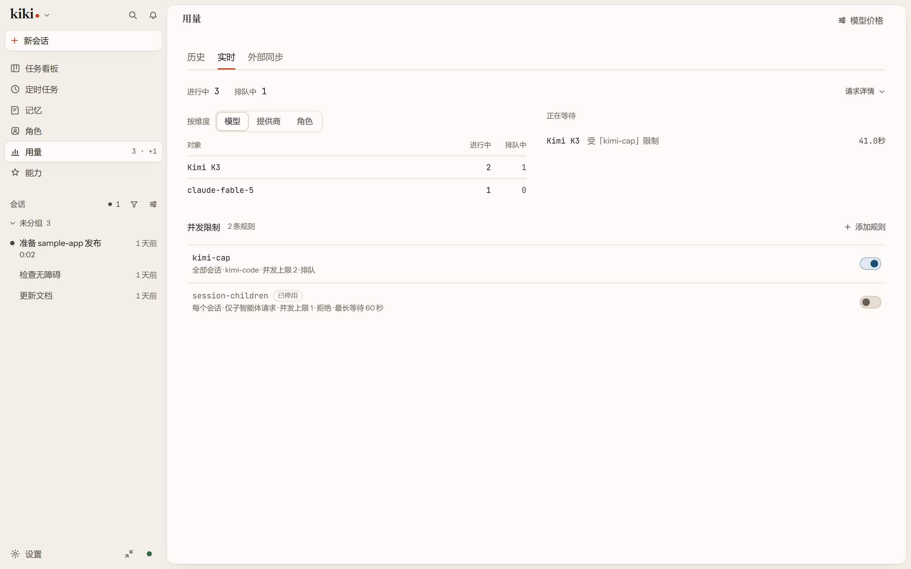

# Kiki

**你的智能体，你说了算。**

[](LICENSE) [](https://x-t-e-r.github.io/kiki/zh/) <br>
[文档](https://x-t-e-r.github.io/kiki/zh/) · [功能一览](https://x-t-e-r.github.io/kiki/zh/features/) · [截图巡览](marketing/gallery.zh-CN.md) · [问题反馈](https://github.com/X-T-E-R/kiki/issues) · [致谢](ACKNOWLEDGEMENTS.zh-CN.md) · [English](README.md)

把一个文件夹和一件事交给 Kiki：它会读材料、做计划，在那里把活干完——事情大了就叫上帮手智能体分头做——再用记忆、任务看板和定时任务让工作持续下去。它是开源的，跑在你自己的机器上。

桌面应用、终端界面和浏览器界面连的是同一个本地守护进程，在一个地方开的会话，在另一个地方打开还是它。



## 从这里开始

### 用桌面版

1. 按你的平台下载桌面版（见下方[桌面版构建](#桌面版构建)），打开 Kiki。
2. 欢迎页先告诉你 Kiki 能帮你做什么，再问它可以自己做多少，最后给几个可以先逛逛的去处。每一处都是同一份简短导览，侧栏的 **发现 Kiki** 随时能再打开它。
3. 在新会话里选一个文件夹、写下要做的事，或点一条起步建议——起步建议只会填进草稿，不会自己发送。还没连接模型时，Kiki 会在你按发送时提示：使用账号登录，或填写 API 密钥或本地服务。

### 用终端

```sh
npm install -g kiki-agent   # 需要 Node.js 24.15.0+；也可以直接下载下方的桌面版
cd your-project
kiki                        # 终端界面；`kiki web` 打开浏览器界面，`kiki desktop` 打开桌面应用
```

运行 `/login`，选择 Kimi Code OAuth 或 Kimi 开放平台 API 密钥——接入其他供应商见[平台与模型](https://x-t-e-r.github.io/kiki/zh/configuration/providers)。然后让它做点什么：

```
帮我看一下这个项目的目录结构，简单介绍一下每个目录是做什么的
```

新会话默认是「自动」模式：日常操作直接执行，碰到敏感文件或危险命令仍会先问你。`/permission` 在「每步询问」（`manual`）、「自动」（`auto`）、「替我审批」（`review`）和「完全放行」（`yolo`）之间切换。

### 桌面版构建

从 [GitHub Releases](https://github.com/X-T-E-R/kiki/releases) 的 `kiki-v<版本号>` 选择构建。

<details>
<summary>平台、文件与首次启动说明</summary>

| 平台 | 桌面应用 | 独立 CLI/TUI |
| --- | --- | --- |
| Windows x64 | `Kiki_*_x64-setup.exe`（同时把 `kiki` 加到用户 `PATH`） | 已包含在安装包里，不另发 Windows CLI 文件 |
| Linux x64 | `Kiki_*_amd64.deb`（安装 `kiki` 命令）或 `Kiki_*_amd64.AppImage` | `kiki-linux-x64` |
| Linux ARM64 | — | `kiki-linux-arm64` |
| macOS Apple Silicon | `Kiki_*_aarch64.dmg` | `kiki-darwin-arm64` |
| macOS Intel | `Kiki_*_x64.dmg` | `kiki-darwin-x64` |

独立 CLI 文件附带对应的 `.sha256` 校验文件。macOS 的 dmg 未签名、未公证：先校验下载，拖入「应用程序」，首次启动用 **按住 Control 键点按 → 打开**；dmg 不会更改 `PATH`，CLI 需单独添加。

npm 安装时，`kiki-agent` 包含 CLI/TUI，并下载对应的桌面构建校验 SHA-256（需要联网）；`kiki-agent-lite` 只装 CLI/TUI。`kiki desktop` 可打开已安装的桌面应用。

> 在 Windows 上，首次启动前请先安装 [Git for Windows](https://gitforwindows.org/)，因为 Kiki CLI 使用自带的 Git Bash 作为 shell 环境。如果 Git Bash 装在别处，请将 `KIKI_SHELL_PATH` 设置为 `bash.exe` 的绝对路径。

运行 `kiki --version` 验证。校验命令和更新通道见[安装](https://x-t-e-r.github.io/kiki/zh/getting-started/installation)。

</details>

## 先做一件事

选好 Kiki 在哪个文件夹里工作、读哪些材料，再把任务交给它。普通、Plan 和 Goal 决定这件事怎么做，结果会带上来源和背后的步骤。新建会话时还可以选一个 git worktree，这个会话的改动就落在自己的分支上，不碰你当前的检出。临时对话不进历史、搜索和记忆，结束即删除。

见[首次启动](https://x-t-e-r.github.io/kiki/zh/getting-started/first-launch)和[交互与审批](https://x-t-e-r.github.io/kiki/zh/guides/interaction)。

## 看懂与指挥工作

### 每个智能体各用各的模型

主智能体拆任务、派子智能体，每个都能绑不同的模型或不同的厂商，在同一个会话里同时跑。强推理模型做规划，便宜的模型跑日常；换个厂商审查，也不会和实现共享同一批盲区。Kimi 开箱即用；Anthropic、OpenAI 兼容服务、OpenAI Responses API、Gemini 和 Vertex AI 都能接，也可以用 GitHub Copilot 或 ChatGPT 账号登录。


智能体本身是你自己的 Markdown 文件：frontmatter 写工具、模型、思考强度和能派发谁，正文就是系统提示词。Kiki 会监视这些目录，改完约 200ms 自动重载。新建时可以从现有 profile 复制、从内置模板起，或者从空白开始——不必先手写。

点开任何一个被派出去的子智能体就能读它自己的记录，也能在它自己的输入框里给它发消息。智能体干活时，你打的字进队列而不是打断它，每条排队消息可以选空闲后、子智能体完成后，或任务完成后发出。耗时的命令转到后台，跑完自动通知智能体，它不用反复去查。见[一个工作台，好几条线](https://x-t-e-r.github.io/kiki/zh/features/workbench)和 [Agent 与 subagent](https://x-t-e-r.github.io/kiki/zh/customization/agents)。

### 在手头的窗口里干活

做完的一段工具调用、思考和 shell 输出折成一行，比如「Worked · 8 steps」，每折都能按原顺序展开。右栏显示待处理的审批和问题、智能体此刻在做什么、上下文和花费、它的工作笔记、智能体团队和后台任务——进到子智能体里，它也跟着过去。批注让你在消息上留一句话、随下一条一起发出去，不必单独打断一轮。

智能体可以用 `HistorySearch` 和 `HistoryRead` 搜自己之前的消息和工具输出——压缩前的内容也在范围内——侧栏里可以按标题搜会话。联网搜索和抓取走可查看的具名通道，GitHub 仓库搜索不需要密钥。外观有六套内置皮肤、图片和视频背景，以及把配色和背景素材打包在一起的外观包。见[每天用的桌面](https://x-t-e-r.github.io/kiki/zh/features/daily)和[外观](https://x-t-e-r.github.io/kiki/zh/features/look)。

### 知道花了多少，也知道数字能送去哪儿

**用量（Usage）** 页把一个日期区间拆成 token、费用和缓存命中率——从未返回用量的平台显示为未知，而不是一个真实的 0——并写明是哪条并发规则挡着每一个等待中的请求。外部同步只发不含内容的统计，提示词、回答、标题和路径一律不发，目的地可以是你自己的 webhook、VibeCafe 账号或一条你批准的脚本；只有你添加目的地、预览确切内容、同意并启用后才会发送。



见[每天用的桌面](https://x-t-e-r.github.io/kiki/zh/features/daily)和 [`kiki usage-export`](https://x-t-e-r.github.io/kiki/zh/reference/command#kiki-usage-export)。

## 让工作持续

目标让主线跨多轮挂着，不必每次重述一遍任务。

比会话活得更久的是记忆：偏好、反馈、已核实的项目事实和参考资料，按全局、工作区或角色分别保存。每一条你都能看，任何一次改动都能逐条撤销——删除也能撤销。把审批设成 `review`，提议的写入会先进收件箱，而不是自己生效。见[记忆指南](https://x-t-e-r.github.io/kiki/zh/guides/memory)。

每个工作区还有一块看板，需求是卡片，关联到正在处理它的会话，智能体自己能读能改。定时提示词覆盖周期性工作：按 cron 触发，只要还有 Kiki 进程持有那个已打开的会话就会跑。见[长时间的活](https://x-t-e-r.github.io/kiki/zh/features/long-work)。

## 按需扩展 Kiki

### 能一起干活的角色

**角色**是长期身份——名字、头像、职责、它该怎样工作的长期约定，以及它自己的记忆——存成一份你能读能改的 Markdown。点它的名字，每次落进的都是同一个对话，所以「找小岚」是同一件事；同一个角色也可以同时有多段对话，分头做不同项目。

**房间**让两到六个角色围绕同一个话题按顺序发言，有主持人、有预算、有暂停和继续。

角色不等于智能体配置（profile）。profile 是执行配置——工具、权限、模型、思考强度；角色是身份——它是谁、记得什么。改一个绑定不会动另一个。见[能一起干活的人](https://x-t-e-r.github.io/kiki/zh/features/people)。


### 技能、插件与工具连接

插件可以加入技能、智能体、MCP 服务器、hooks、命令和工具，在「能力」页浏览安装，官方市场里有 Kiki Office Suite 和 Kiki Writing。会话留在你自己的机器上，不经过云端中转。

## 数据与机器都在你手上

**空间**就是你要打开的某一个 Kiki，有自己的快捷方式、窗口行为和凭据范围——与主空间共享，或者本空间独立——所以工作的 Kiki 和个人的 Kiki 可以并排放着，不必共享能登录的东西。

**远端连接**把一个 Kiki home 指向另一个，两边各自审批，每条连接是带自己状态的一行。**Thread bridge** 更窄：两个 home 之间传消息的单向通道，永远不给浏览权限。**Web 访问**用一条一次性链接把这个 Kiki 开给另一台设备上的浏览器，关掉时撤销所有链接，但不会停掉已经在跑的活。加入会话的 **SSH 主机**属于这个会话，所以时间线保持干净。见[数据与机器都在你手上](https://x-t-e-r.github.io/kiki/zh/features/spaces)。

## 带进历史，接上别的工具

内置提示词的任意字段都能换掉，细到单个工具描述，可以全局、按模型或按智能体设，`kiki prompt-fields` 能看到模型最终收到什么。把别的工具的对话导成能接着做的 Kiki 会话，或只读归档；预览会告诉你保留什么、不保留什么，不用安装也不用信任任何东西。`kiki acp` 让 Kiki 跑在 Zed、JetBrains 等 ACP 客户端里，`kiki seat` 让 Cursor、Claude Code、Codex 作为服务调用它，工作区、权限模式和模型在它们连上之前就定好了。一个 agent profile 也可以整个跑在别的 harness 上当引擎。见[带过来，也接得进外面](https://x-t-e-r.github.io/kiki/zh/features/ecosystem)和[每一层都归你](https://x-t-e-r.github.io/kiki/zh/features/freedom)。

## 文档

[全部功能](https://x-t-e-r.github.io/kiki/zh/features/) · [首次启动](https://x-t-e-r.github.io/kiki/zh/getting-started/first-launch) · [Kiki 桌面版](https://x-t-e-r.github.io/kiki/zh/getting-started/desktop-app) · [Agent Profiles](https://x-t-e-r.github.io/kiki/zh/customization/agent-profiles) · [插件](https://x-t-e-r.github.io/kiki/zh/customization/plugins) · [交互与审批](https://x-t-e-r.github.io/kiki/zh/guides/interaction) · [配置](https://x-t-e-r.github.io/kiki/zh/configuration/config-files) · [命令参考](https://x-t-e-r.github.io/kiki/zh/reference/command) · [工具参考](https://x-t-e-r.github.io/kiki/zh/reference/tools)

## 开发

环境要求：Node.js ≥ 24.15.0，pnpm 10.33.0。

```sh
git clone https://github.com/X-T-E-R/kiki.git && cd kiki && pnpm install
pnpm dev:cli    # 以开发模式运行 CLI
pnpm test       # 测试  ·  pnpm typecheck  ·  pnpm lint  ·  pnpm build
```

完整贡献指南见 [CONTRIBUTING.md](CONTRIBUTING.md)。问题请提到 [Issues](https://github.com/X-T-E-R/kiki/issues)；安全漏洞请参见 [SECURITY.md](SECURITY.md)。

## 致谢

Kiki 最初是 [Kimi Code](https://github.com/MoonshotAI/kimi-code) 的 fork，现已独立发展；TUI 构建于 [`pi-tui`](https://github.com/earendil-works/pi-mono/tree/main/packages/tui) 之上；桌面应用还改编了其他几个开源项目的代码和交互方式。每个项目 Kiki 用了什么、采用什么许可证，见 [ACKNOWLEDGEMENTS.zh-CN.md](ACKNOWLEDGEMENTS.zh-CN.md)。

## 许可证

基于 [MIT 许可证](LICENSE)发布。
