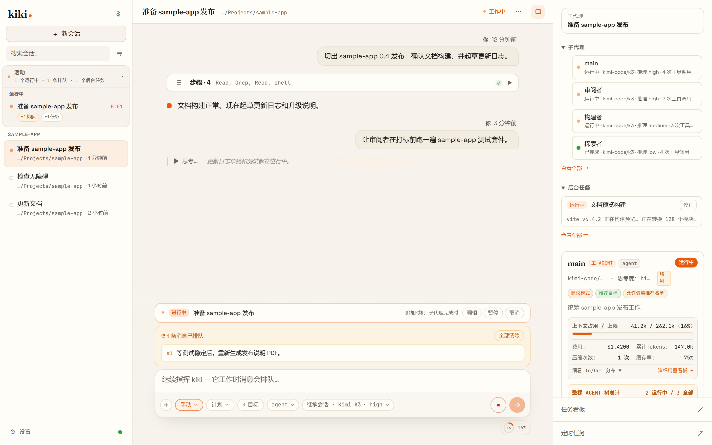
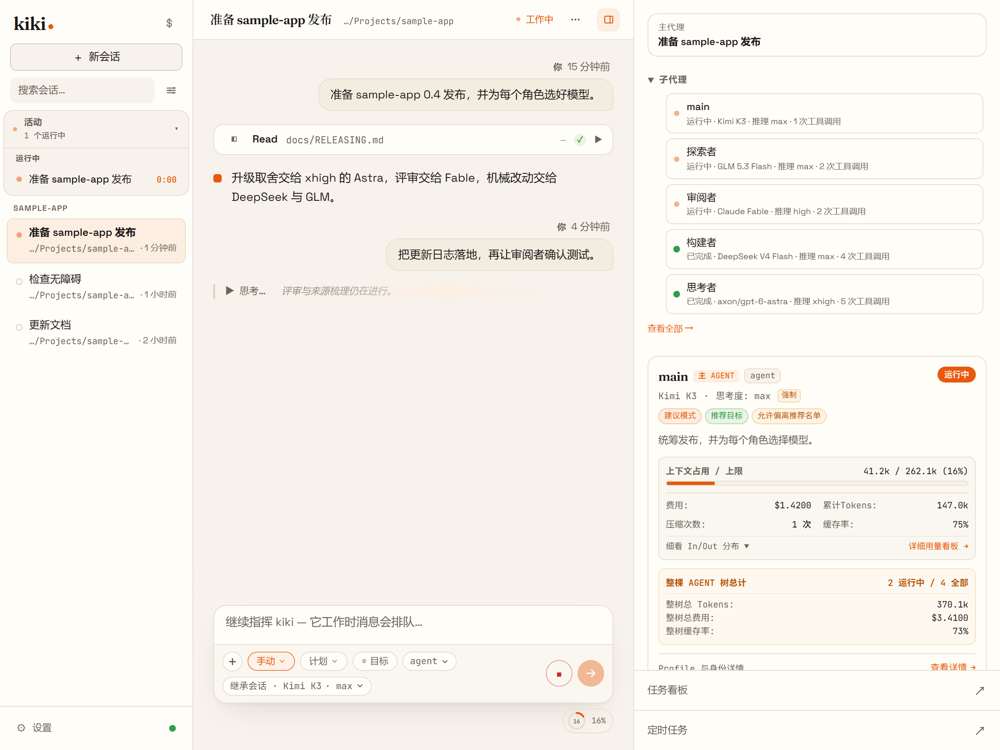
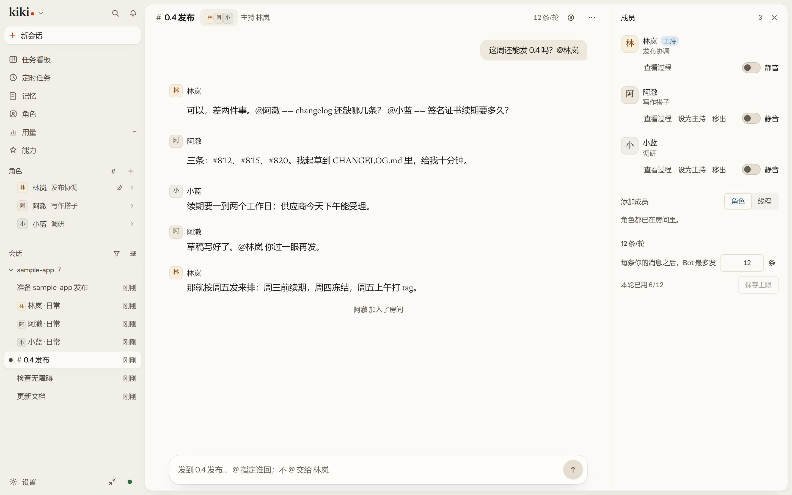

# Kiki

**你的智能体，你说了算。**

[](LICENSE) [](https://x-t-e-r.github.io/kiki/zh/) <br>
[文档](https://x-t-e-r.github.io/kiki/zh/) · [功能一览](https://x-t-e-r.github.io/kiki/zh/features/) · [截图巡览](marketing/gallery.zh-CN.md) · [问题反馈](https://github.com/X-T-E-R/kiki/issues) · [致谢](ACKNOWLEDGEMENTS.zh-CN.md) · [English](README.md)

Kiki 是一个开源的 AI 智能体工作台，跑在你自己的机器上。桌面应用、终端界面和浏览器界面连的是同一个本地守护进程，所以同一批会话在哪儿都能打开。

常见用法：

- 把编码或调研任务交给主智能体，由它拆给多个子智能体，每个角色跑你为它选定的模型。
- 让长任务持续推进：跨多轮的目标、它忙时你说的话先排队、定时投递的提示词，以及每个工作区一块任务看板。
- 精确控制每个智能体看到什么，从工具和模型，细到单个工具描述的措辞。

<!-- 主图：主会话调度多条线的真实录屏（见 marketing/launch/demo-storyboard.md）录好后替换。 -->


*示例场景由真实 Kiki 界面渲染，不代表模型性能实测；之后会换成真实录屏。*

## 一分钟上手

```sh
npm install -g kiki-agent   # 需要 Node.js 24.15.0+；也可以直接下载下方的桌面版
cd your-project
kiki                        # 终端界面；`kiki web` 打开浏览器界面，`kiki desktop` 打开桌面应用
```

运行 `/login`，选择 Kimi Code OAuth 或 Kimi 开放平台 API 密钥（接入其他供应商见[平台与模型](https://x-t-e-r.github.io/kiki/zh/configuration/providers)）。然后试一句：

```
帮我看一下这个项目的目录结构，简单介绍一下每个目录是做什么的
```

新会话默认是「自动」模式：日常操作直接执行，碰到敏感文件或危险命令仍会先问你。用 `/permission` 在手动、自动、审查和 YOLO 之间切换。Windows 用户请先装好 Git for Windows（见下文）。

## 安装

从 [GitHub Releases](https://github.com/X-T-E-R/kiki/releases) 的 `kiki-v<版本号>` 选择构建：

| 平台 | 桌面应用 | 独立 CLI/TUI |
| --- | --- | --- |
| Windows x64 | `Kiki_*_x64-setup.exe`（同时把 `kiki` 加到用户 `PATH`） | 已包含在安装包里，不另发 Windows CLI 文件 |
| Linux x64 | `Kiki_*_amd64.deb`（安装 `kiki` 命令）或 `Kiki_*_amd64.AppImage` | `kiki-linux-x64` |
| Linux ARM64 | — | `kiki-linux-arm64` |
| macOS Apple Silicon | `Kiki_*_aarch64.dmg` | `kiki-darwin-arm64` |
| macOS Intel | `Kiki_*_x64.dmg` | `kiki-darwin-x64` |

独立 CLI 文件附带对应的 `.sha256` 校验文件。macOS 的 dmg 未签名、未公证：先校验下载，拖入「应用程序」，首次启动用 **按住 Control 键点按 → 打开**。dmg 不会更改 `PATH`，CLI 需单独添加。

npm 安装：`kiki-agent` 包含 CLI/TUI，安装时会从 GitHub 下载对应的桌面构建并校验 SHA-256（需要联网）；`kiki-agent-lite` 只装 CLI/TUI。`kiki desktop` 可打开已安装的桌面应用，未安装时会提示获取方式。

> 在 Windows 上，首次启动前请先安装 [Git for Windows](https://gitforwindows.org/)，因为 Kiki CLI 使用自带的 Git Bash 作为 shell 环境。如果 Git Bash 安装在自定义位置，请将 `KIKI_SHELL_PATH` 设置为 `bash.exe` 的绝对路径。

新开终端运行 `kiki --version` 验证。校验命令和更新通道见[安装](https://x-t-e-r.github.io/kiki/zh/getting-started/installation)。

## 智能体与模型

- **每个角色单独绑模型。** 主智能体、各个子智能体和审查者可以绑不同的模型，同一个会话里混用多家厂商。Kimi 开箱即用；Anthropic、OpenAI 兼容服务、OpenAI Responses API、Gemini 和 Vertex AI 都能接，也可以用 GitHub Copilot 或 ChatGPT 账号登录。
- **智能体就是你自己的 Markdown 文件。** frontmatter 写工具、模型、思考强度和能派发谁，正文就是系统提示词。Kiki 会监视智能体目录，改完约 200ms 自动重载。frontmatter 的字段是封闭的：Claude Code 或 OpenCode 的 agent 文件，删掉 Kiki 不认识的字段（比如 Claude Code 的 `model`、OpenCode 的 `mode`）就能加载。
- **提示词细到单个工具描述。** 内置提示词的任意字段都能改，可以全局改，也可以按模型、按智能体单独改。`kiki prompt-fields list | show | explain` 能看到模型最终收到了什么、每个值来自哪一层。
- **子智能体做完会回报。** 主智能体自己派子智能体、把耗时命令转到后台，完成后会收到通知，不用反复去查。任何子智能体的记录都能打开，也能在它自己的输入框里给它发消息。
- **隔离的 worktree。** 新建会话时选一个 git worktree，这个会话的改动落在独立分支上，不碰你当前的检出。
- **把别的智能体当引擎用。** 智能体配置可以通过 ACP 或 Codex app-server 跑在 Claude Code、Codex、Cursor、Gemini CLI、Kimi CLI、OpenCode 或 Grok Build 上。设置 → 外部引擎会检查每个引擎是否已安装，并列出还差哪些配置步骤。



## 长时间的活

- **它忙的时候你照样能说话。** 你发的消息先进队列，每条可以单独选什么时候发出：空闲后、子智能体完成后，或任务完成后；还能调顺序、改内容，或者立刻发出。
- **目标。** 消息以 `/goal` 开头会生成一张目标卡片，智能体跨多轮持续推进，可以编辑、暂停和取消。
- **定时提示词。** 智能体可以安排一次性或按 cron 表达式重复的提示词，全局面板列出所有定时任务。计划仅在有 Kiki 进程持有该已打开会话时才会触发。
- **每个工作区一块任务看板。** 需求以卡片形式存在，关联到正在处理它的会话，智能体自己能读能改。
- **上下文撑得住。** 压缩点由你自己定；上下文满了时，由你选让智能体压成摘要、只从工作笔记重启，还是每次自己判断。工作笔记在压缩后保留，记忆比会话活得更久。
- **比会话活得更久的记忆。** 偏好、反馈、已核实的项目事实和参考资料，保存在你可以按全局、工作区或角色分别查看的记忆里。每次改动都能逐条撤销；把审批设成 `review`，提议的写入会先进收件箱而不是直接生效。见[记忆指南](https://x-t-e-r.github.io/kiki/zh/guides/memory)。
- **能一起干活的人。** 角色是长期身份：有自己的记忆、有每天都能回到的固定对话入口，也能进房间，两到六个人按顺序讨论同一个话题。见[角色与房间](https://x-t-e-r.github.io/kiki/zh/customization/personas)。



**[能一起干活的人 →](https://x-t-e-r.github.io/kiki/zh/features/people)**

## 找回之前的内容

- **给智能体用的会话历史。** `HistorySearch`、`HistoryRead` 和 `HistoryList` 让智能体搜索之前的消息和工具输出、读取某一轮或某一步的原文、浏览会话的轮次目录，压缩前的内容也在范围内。默认只查当前会话、当前智能体，需要时可以扩大到整个工作区。

  主智能体的 `TodoList` 笔记可以在 `directives` 和 `decided` 中用 `[m_id]` 引用记忆。压缩时，交接文本会带上当前标题、跟随替代条目，并把已归档条目标为已撤回。解析这些引用不会改写保存的笔记或冻结的系统提示词。

- **侧栏搜索。** 会话标题始终可搜。对话内容的全文搜索在 CLI 服务端可用；打包的桌面应用里它是实验性选项（设置 → 搜索与检索），因为首次建索引可能要 20–30 分钟，且至少需要 2 GB 可用磁盘空间。
- **联网搜索与抓取。** 搜索和网页抓取走可查看的具名通道。GitHub 仓库搜索不需要密钥；同一供应商配了多个密钥时会在调用之间轮换。

## 数据与机器都在你手上

- **空间。** 每个空间就是你要打开的某一个 Kiki，有自己的快捷方式、窗口行为和凭据范围——与主空间共享，或者本空间独立。工作的 Kiki 和个人的 Kiki 可以并排放着，不必共享能登录的东西。
- **远端连接。** 从一个 Kiki home 指向另一个的有向链路，两边各自审批。接收默认关闭，每条连接是一行，带自己的状态，`inbound revoke` 停掉某一个来源，不影响其他已批准的。
- **Thread bridge。** 两个 home 之间传线程消息的单向通道，只带目标批准的范围和操作。桥永远不授予 GUI 浏览权限。
- **Web 访问。** 把*这个* Kiki 开给另一台设备上的浏览器。每次运行打印一条一次性链接，关掉时会撤销所有链接，但不会停掉你正在跑的活。
- **会话内 SSH。** 加入会话的主机是会话的资源，不会随每条消息重复携带，所以时间线保持干净。

**[数据与机器都在你手上 →](https://x-t-e-r.github.io/kiki/zh/features/spaces)**

## 桌面应用

- **时间线不会越拉越乱。** 做完的一段工具调用、思考和 shell 输出折叠成一行，比如「Worked · 8 steps」。进行中的这一轮和已结束的子智能体也这样折叠，图片结果单独占一行，每个折叠都能按原顺序展开。
- **右栏跟着当前智能体。** 它显示待处理的审批和问题、智能体此刻在做什么、上下文和花费、待办清单与工作笔记、智能体团队和后台任务。进入子智能体时，同一个右栏跟着过去。
- **输入框直接处理决定。** 有审批或问题等你时，它会接管输入框卡片，处理完你的草稿原样回来。批注、目标和队列都收在同一张卡片里，回车键的行为可以自己设。
- **批注。** 在任意消息上留一条批注，随你的下一条消息一起发出去，不必单独打断一轮。
- **临时对话。** 从 `/new`、侧栏或会话顶栏开启（终端里用 `kiki --ephemeral`）。临时对话不进历史、搜索和记忆，结束即删除。
- **以输入框为中心的新会话页。** 选好工作区、worktree 和智能体就可以打字，第一条消息发出后平滑过渡到会话视图。
- **找得到东西的设置。** 从「通用」到「实验室」约二十个页面，支持搜索。模型选单会标出每个模型的上下文大小和自动压缩点，并标记不支持图片输入的模型。
- **外观。** 内置多套皮肤，支持图片和视频背景，以及把配色和背景素材打包在一起的外观包。

## 插件与集成

- **插件。** 插件可以添加技能、智能体、MCP 服务器、hooks、命令、工具和沙箱面板。在「能力」页浏览、安装和配置插件。带 `.claude-plugin/plugin.json` 清单的 Claude Code 插件也能安装。官方市场里有 Kiki Office Suite（通过 OfficeCLI 处理 Word、Excel 和 PowerPoint）和 Kiki Writing。
- **把别的工具的历史带进来。** 把 Claude Code、Codex、Pi、Grok Build、OpenCode 的对话导成能接着做的 Kiki 会话，或存成只读归档。预览会告诉你保留什么、不保留什么——不用安装、不用信任、不用启用任何东西。
- **通过 ACP 接入 IDE。** `kiki acp` 让 Zed、JetBrains 等 [ACP](https://agentclientprotocol.com/) 客户端驱动 Kiki 会话，见 [ACP 指南](https://x-t-e-r.github.io/kiki/zh/server/acp)。
- **外部工具调用 Kiki。** `kiki seat` 为 Cursor、Claude Code、Codex 这类入站 MCP 客户端固定席位：工作区、权限模式和模型在它们连上之前就定好了，之后调用方改不了。
- **数据留在本地。** 会话都存在你的机器上，不经过云端中转。

**[查看全部功能 →](https://x-t-e-r.github.io/kiki/zh/features/)**

## 文档

[首次启动](https://x-t-e-r.github.io/kiki/zh/getting-started/first-launch) · [桌面应用](https://x-t-e-r.github.io/kiki/zh/getting-started/desktop-app) · [Agent Profiles](https://x-t-e-r.github.io/kiki/zh/customization/agent-profiles) · [提示词字段覆写](https://x-t-e-r.github.io/kiki/zh/customization/prompt-fields) · [插件](https://x-t-e-r.github.io/kiki/zh/customization/plugins) · [交互与审批](https://x-t-e-r.github.io/kiki/zh/guides/interaction) · [配置](https://x-t-e-r.github.io/kiki/zh/configuration/config-files) · [命令参考](https://x-t-e-r.github.io/kiki/zh/reference/command) · [工具参考](https://x-t-e-r.github.io/kiki/zh/reference/tools)

## 开发

环境要求：Node.js ≥ 24.15.0，pnpm 10.33.0。

```sh
git clone https://github.com/X-T-E-R/kiki.git && cd kiki && pnpm install
pnpm dev:cli    # 以开发模式运行 CLI
pnpm test       # 测试  ·  pnpm typecheck  ·  pnpm lint  ·  pnpm build
```

完整贡献指南见 [CONTRIBUTING.md](CONTRIBUTING.md)。问题请提到 [Issues](https://github.com/X-T-E-R/kiki/issues)；安全漏洞请参见 [SECURITY.md](SECURITY.md)。

## 致谢

Kiki 最初是 [Kimi Code](https://github.com/MoonshotAI/kimi-code) 的 fork，现已独立发展；TUI 构建于 [`pi-tui`](https://github.com/earendil-works/pi-mono/tree/main/packages/tui) 之上；桌面应用还改编了其他几个开源项目的代码和交互方式。每个项目 Kiki 用了什么、采用什么许可证，见 [ACKNOWLEDGEMENTS.zh-CN.md](ACKNOWLEDGEMENTS.zh-CN.md)。

## 许可证

基于 [MIT 许可证](LICENSE)发布。
