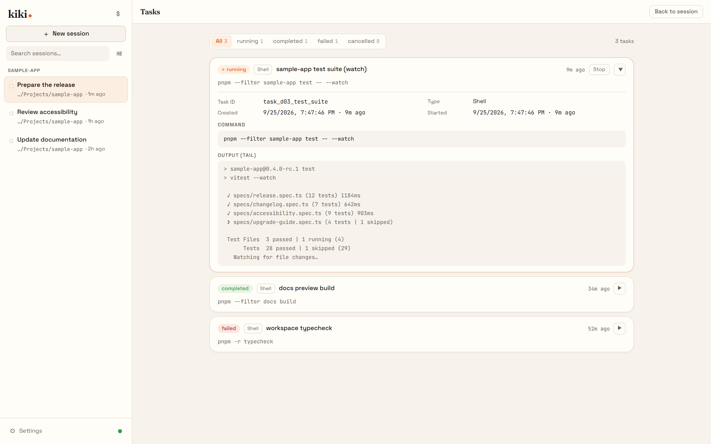
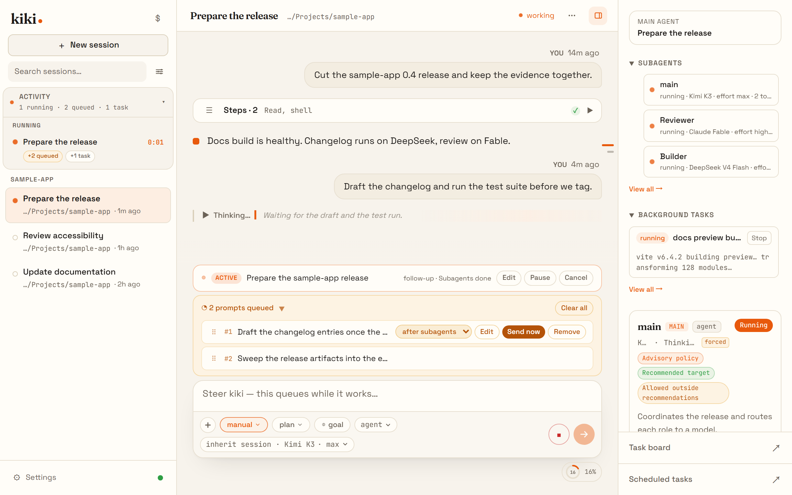
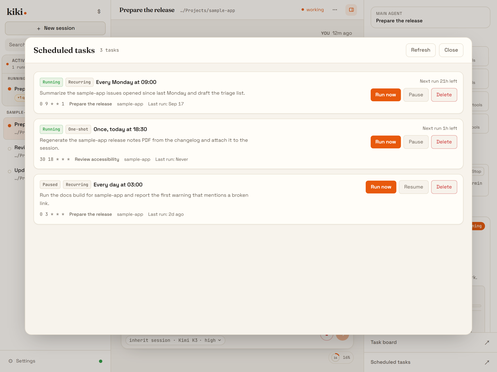
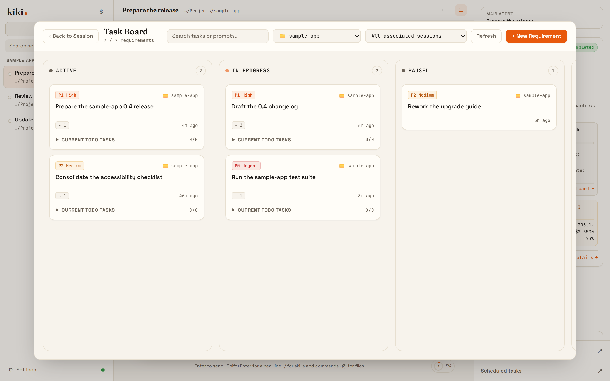
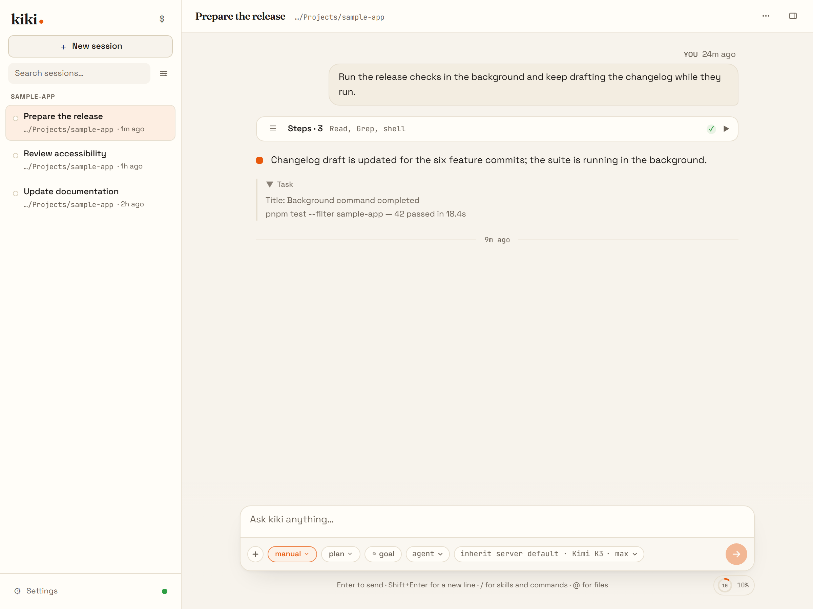
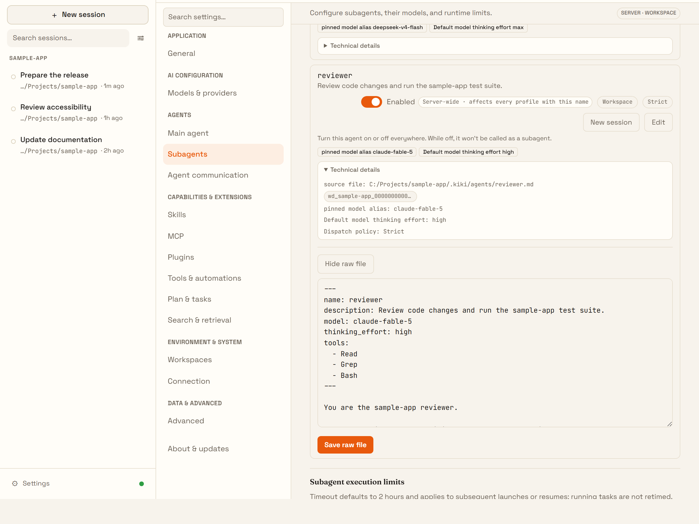
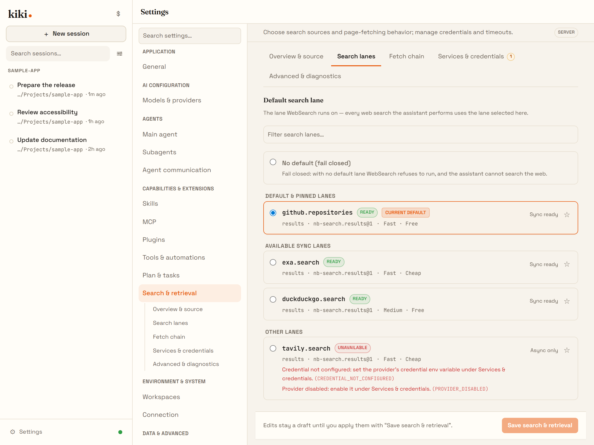

# Kiki features

Each capability below has one line on what it does for you and a link to the full docs. The online **Features** section is the long-form tour; this page is the in-repo index. [Back to the README](../README.md) · [Screenshot tour](gallery.en.md) · [Online features →](https://x-t-e-r.github.io/kiki/en/features/)

*Screenshots are rendered by the real Kiki UI on an example project. They show the interface, not measured model performance.*

## One workbench, many lines

### Subagents, each on its own model

The main agent dispatches subagents itself, and each role can run a different provider's model, so a strong model can plan while cheaper models do the routine work. Each subagent has its own context, and you can open its transcript.

[Online page →](https://x-t-e-r.github.io/kiki/en/features/workbench) · [Named child agents →](https://x-t-e-r.github.io/kiki/en/customization/agents#named-child-agents)

### Background tasks

Long commands and subagents can run in the background. When one finishes, its result goes back to the agent automatically, so neither you nor the agent has to keep checking on it.

[Online page →](https://x-t-e-r.github.io/kiki/en/features/workbench) · [Background tasks →](https://x-t-e-r.github.io/kiki/en/reference/tools#background-tasks)

## Work that runs long

### Goals and the message queue

Give the agent a goal with `/goal` and it keeps working toward it across turns. `/goal next` lines up the next goal, and messages you send while the agent is busy wait in a queue instead of cutting it off. Each queued message can go out when the agent is idle, after its subagents finish, or after its tasks finish.

[Online page →](https://x-t-e-r.github.io/kiki/en/features/long-work) · [Goals →](https://x-t-e-r.github.io/kiki/en/guides/goals#queue-upcoming-goals)

### Scheduled tasks

The agent can schedule a prompt to run in the current session, either once or on a cron schedule. Use this for recurring checks, reports, and reminders.

[Online page →](https://x-t-e-r.github.io/kiki/en/features/long-work) · [Scheduled tasks →](https://x-t-e-r.github.io/kiki/en/reference/tools#scheduled-tasks)

### Task board

Each workspace has a board where requirements are cards, each linked to the sessions working on it. The main agent can read and update the board too.

[Online page →](https://x-t-e-r.github.io/kiki/en/features/long-work) · [Task board spotlight →](task-board.en.md) · [Docs →](https://x-t-e-r.github.io/kiki/en/guides/sessions#task-board)

### Memory

Memory keeps facts across sessions in three scopes — global, one workspace, or one persona. Every change is undoable one operation at a time, and with approval set to `review` a proposed write waits in an inbox instead of taking effect on its own.

[Memory →](https://x-t-e-r.github.io/kiki/en/guides/memory)

## The daily driver

### The timeline stays readable

Finished stretches of tool calls, thinking, and shell output fold into one line such as "Worked · 8 steps", and every fold opens back up in its original order.

[Online page →](https://x-t-e-r.github.io/kiki/en/features/daily) · [Interface overview →](https://x-t-e-r.github.io/kiki/en/guides/interface)

### Usage

The usage page has three tabs: token and cost history for a date range, live running and queued requests with concurrency limits, and content-free external sync.

[Usage →](https://x-t-e-r.github.io/kiki/en/guides/settings#usage)

## Roles you can talk to

### Personas and rooms

A persona is a persistent identity with its own memory, a fixed daily conversation you can return to, and a seat in a room where two to six of them discuss a topic in order. A persona is not a profile: the profile decides tools, permissions, and model, while the persona decides who this is.

[Online page →](https://x-t-e-r.github.io/kiki/en/features/people) · [Personas, Bots, and rooms →](https://x-t-e-r.github.io/kiki/en/customization/personas)

## Your data, your machines

### Spaces

Each space is a Kiki you open, with its own shortcuts, window behavior, and credential scope — shared with the main space or isolated.

[Online page →](https://x-t-e-r.github.io/kiki/en/features/spaces) · [Settings pages →](https://x-t-e-r.github.io/kiki/en/guides/settings)

### Remote connections and thread bridges

A remote connection is a directed, approved link from one Kiki home to another; a thread bridge is a one-way message channel that never grants browsing access.

[`kiki connections` →](https://x-t-e-r.github.io/kiki/en/reference/command#kiki-connections) · [`kiki bridges` →](https://x-t-e-r.github.io/kiki/en/reference/command#kiki-bridges)

### Web access

Open this Kiki in a browser on another device. Each run prints a single-use link, and turning it off revokes every link without stopping running work.

[Web access →](https://x-t-e-r.github.io/kiki/en/server/local-server#use-kiki-in-a-browser)

## Every layer is yours

### Agent files you own

Each agent is a Markdown file: the frontmatter sets its tools, model, effort, and which subagents it may dispatch, and the body is its system prompt. In the app you can create one by copying an existing profile, from a shipped template, or blank.

[Online page →](https://x-t-e-r.github.io/kiki/en/features/freedom) · [Agent file format →](https://x-t-e-r.github.io/kiki/en/customization/agents#agent-file-format)

### Prompt field overrides

You can replace any named part of the built-in prompt, down to a single tool description, globally, per model, or per agent, and `kiki prompt-fields` shows what the model will receive.

[Prompt field overrides →](https://x-t-e-r.github.io/kiki/en/customization/prompt-fields)

### Connections and OAuth

Every way Kiki reaches a model is one row in one list, and how it authenticates is part of that row. Sign in with a subscription account over a device flow, or reuse a sign-in the machine already holds.

[Connections →](https://x-t-e-r.github.io/kiki/en/guides/settings#connections)

### Permission modes

Manual asks for side effects, Auto handles routine work and still asks about sensitive targets, YOLO approves everything, and **Approve for me** routes policy-generated approval requests to a reviewer you configured. Explicit deny rules always win.

[Interaction and approvals →](https://x-t-e-r.github.io/kiki/en/guides/interaction#permission-modes)

### Hooks

Run your own scripts on lifecycle events: block a dangerous shell command, add context when a message is submitted, or get a notification when a task finishes.

[Hooks →](https://x-t-e-r.github.io/kiki/en/customization/hooks)

## Bring your history, meet other tools

### Session history import

Import Claude Code, Codex, Pi, Grok Build, or OpenCode conversations as Kiki sessions you can keep working in, or as read-only archives. The preview states what is kept and what is not; nothing is installed, trusted, or activated to reach it.

[Session history import →](https://x-t-e-r.github.io/kiki/en/customization/plugins#session-history-import)

### Editors over ACP

Run `kiki acp` to use Kiki as the agent inside Zed, JetBrains IDEs, Paseo, or other Agent Client Protocol clients.

[Online page →](https://x-t-e-r.github.io/kiki/en/features/ecosystem) · [Using Kiki in IDEs →](https://x-t-e-r.github.io/kiki/en/server/ide)

### External tools calling Kiki

`kiki seat` fixes a seat for inbound MCP clients: the workspace, permission mode, and model are settled before the caller connects.

[`kiki seat` →](https://x-t-e-r.github.io/kiki/en/reference/command#kiki-seat)

## Look and extend

### Skins and appearance

Six built-in skin families, a picture or video background, and appearance packs that bundle colors with media.

[Online page →](https://x-t-e-r.github.io/kiki/en/features/look) · [GUI skins →](https://x-t-e-r.github.io/kiki/en/customization/skins)

### Plugins, MCP, and skills

Connect MCP servers for external tools, save reusable workflows as skills that also work as slash commands, and install plugins that bundle skills, agents, and MCP servers together.

[Online page →](https://x-t-e-r.github.io/kiki/en/features/extend) · [Plugins →](https://x-t-e-r.github.io/kiki/en/customization/plugins) · [MCP →](https://x-t-e-r.github.io/kiki/en/server/mcp) · [Skills →](https://x-t-e-r.github.io/kiki/en/customization/skills)

### Web search and fetch

Search and page fetching run on named lanes you can inspect. GitHub and Context7 lanes work without a key, and multiple keys per provider rotate with cooldowns.

[nb-search spotlight →](nb-search.en.md) · [Search and retrieval →](https://x-t-e-r.github.io/kiki/en/guides/settings#search-retrieval)

## Desktop, terminal, and browser

The desktop app, the terminal UI (`kiki`), and the browser UI (`kiki web`) share one local daemon and read and write the same session data.

[Desktop app →](https://x-t-e-r.github.io/kiki/en/getting-started/desktop-app) · [First launch →](https://x-t-e-r.github.io/kiki/en/getting-started/first-launch) · [Local server and browser UI →](https://x-t-e-r.github.io/kiki/en/server/local-server)
