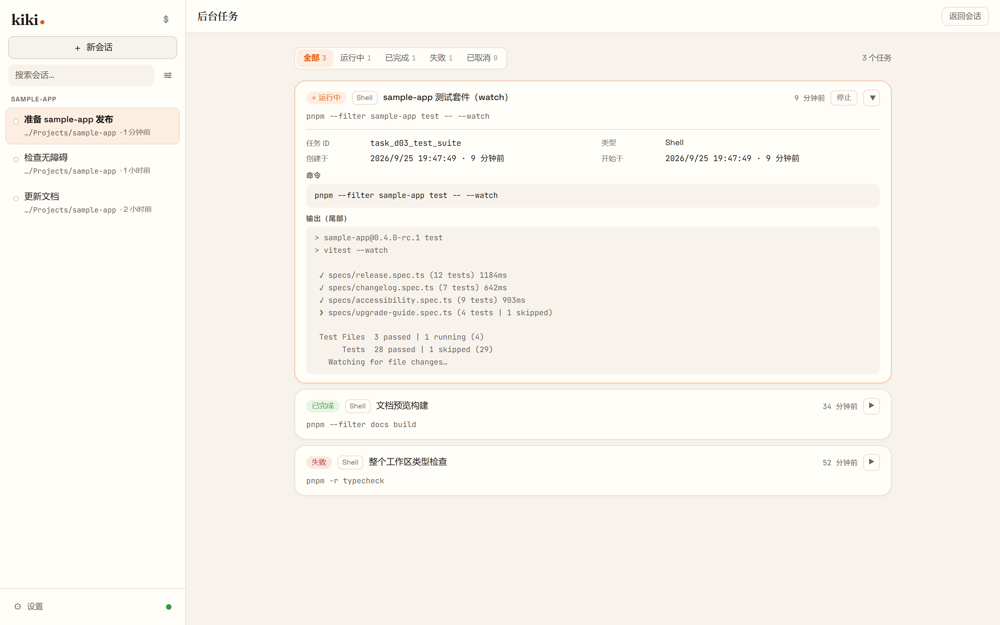
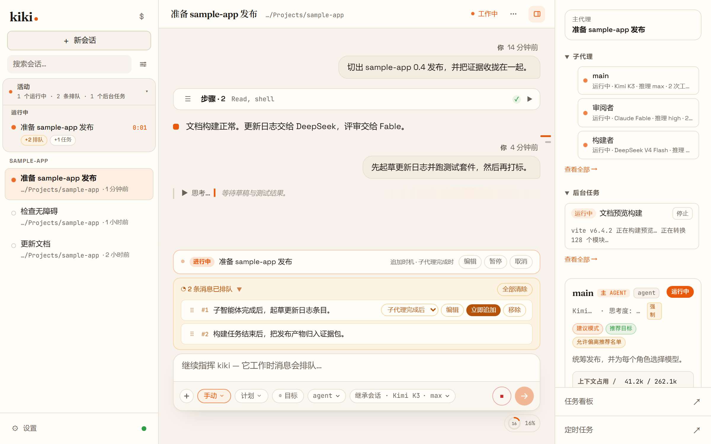
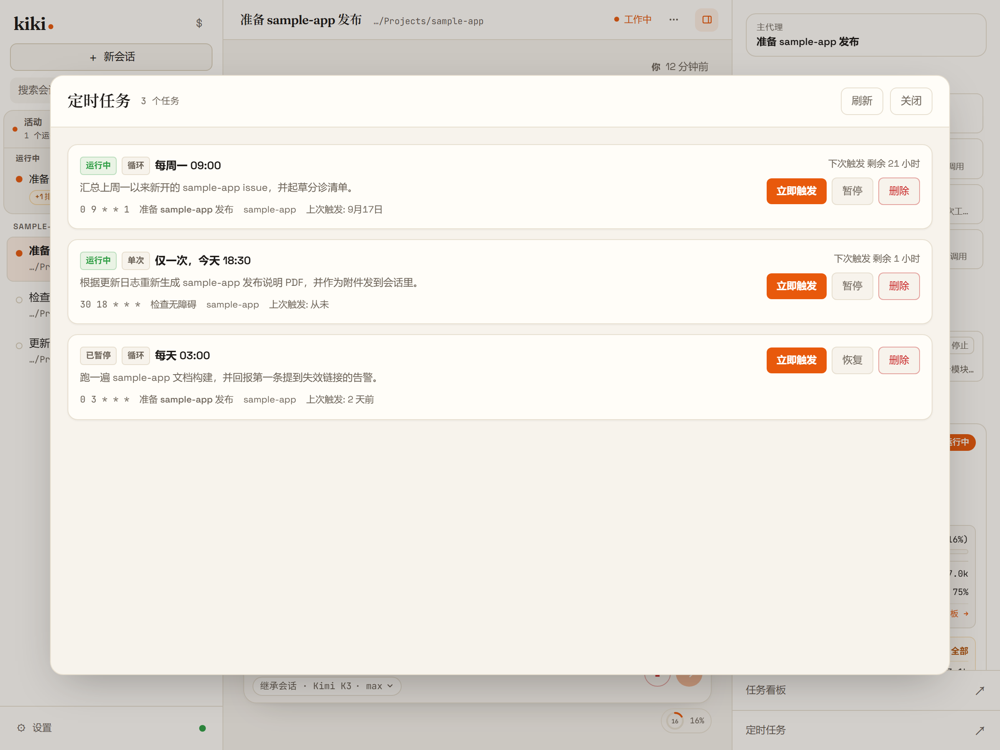
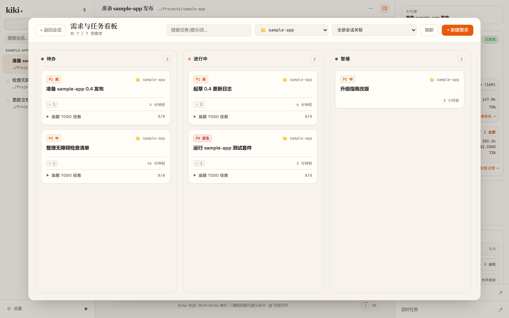
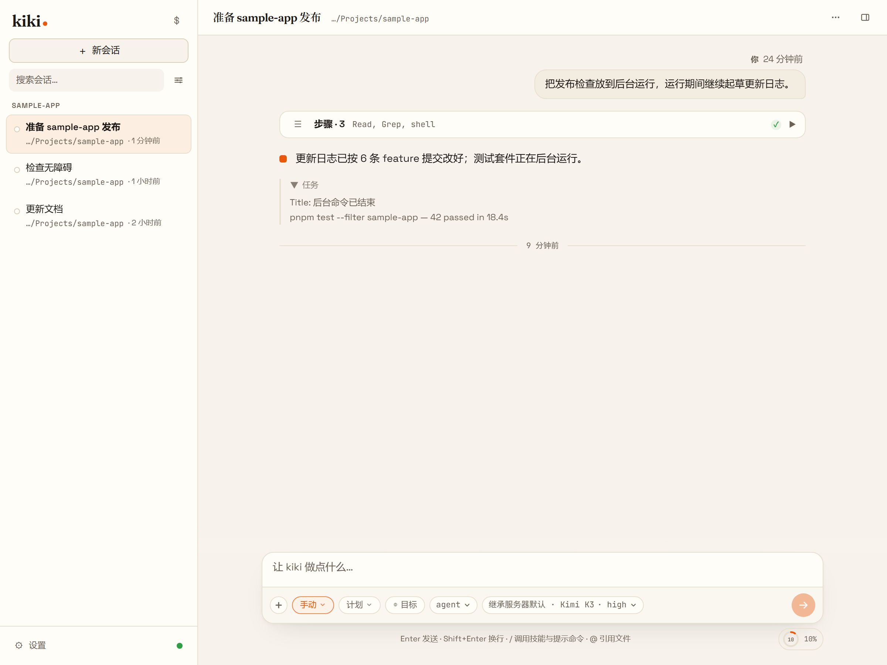
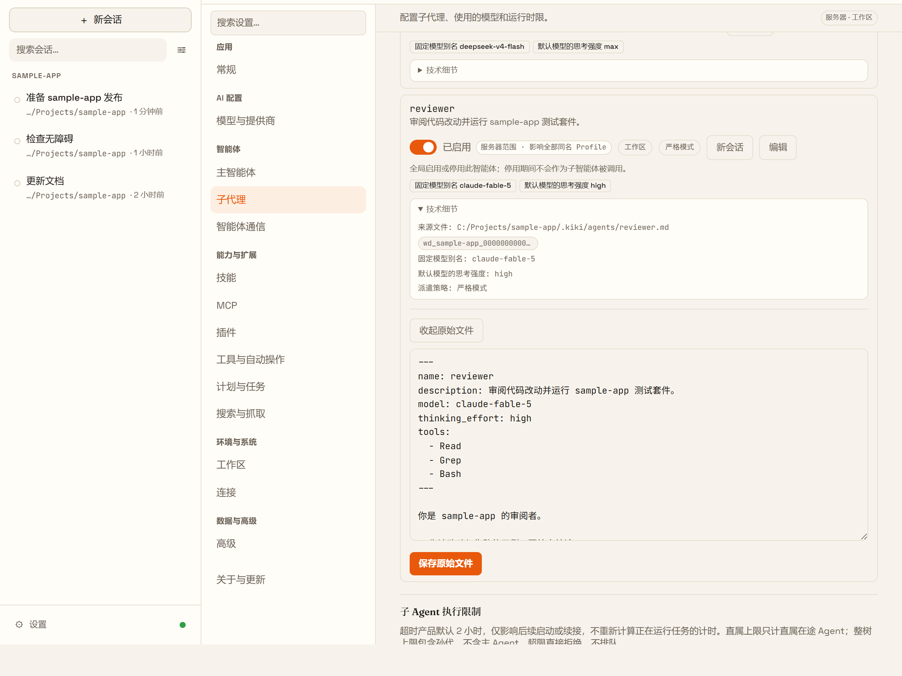
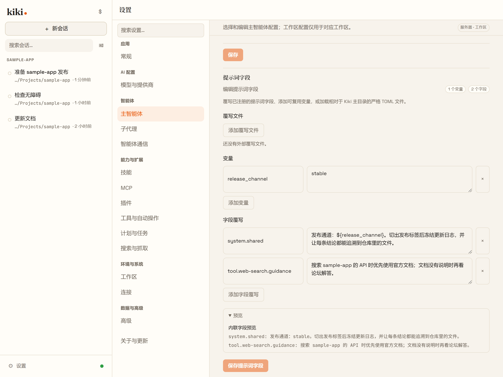
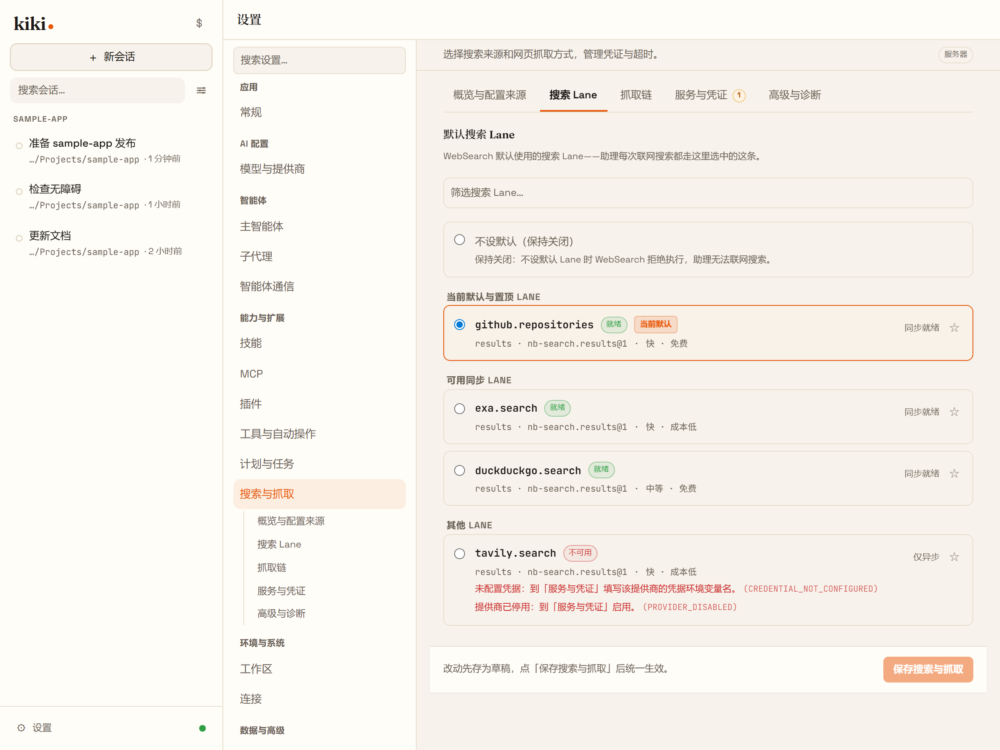

# Kiki 功能一览

每项功能一句话说明，并链到完整文档。在线的**功能介绍**分类是完整导览，这一页是仓库内的索引。[返回 README](../README.zh-CN.md) · [截图巡览](gallery.zh-CN.md) · [在线功能一览 →](https://x-t-e-r.github.io/kiki/zh/features/)

*截图由真实 Kiki 界面在示例项目上渲染，展示的是界面，不代表模型性能实测。*

## 一个工作台，好几条线

### 子智能体，各用各的模型

主智能体会自己派子智能体干活，每个角色可以绑不同供应商的模型：强模型负责规划，便宜的模型跑杂活。每个子智能体有独立上下文，对话记录随时点开看。

[在线页面 →](https://x-t-e-r.github.io/kiki/zh/features/workbench) · [具名子 Agent →](https://x-t-e-r.github.io/kiki/zh/customization/agents#具名子-agent)

### 后台任务

耗时的命令和子智能体可以丢到后台跑，跑完结果会自动回到智能体手里，你和它都不用盯着。

[在线页面 →](https://x-t-e-r.github.io/kiki/zh/features/workbench) · [后台任务 →](https://x-t-e-r.github.io/kiki/zh/reference/tools#后台任务)

## 长时间的活

### 目标与消息队列

用 `/goal` 定一个目标，智能体会跨多轮一直推进；`/goal next` 可以提前排好下一个目标。它忙的时候你发的消息先进队列，不会打断它；每条消息可以单独选什么时候发：空闲后、子智能体完成后，或任务完成后。

[在线页面 →](https://x-t-e-r.github.io/kiki/zh/features/long-work) · [目标模式 →](https://x-t-e-r.github.io/kiki/zh/guides/goals#安排后续目标)

### 定时任务

智能体可以在当前会话里定时投一条 prompt，一次性或按 cron 周期都行，适合定期检查、日报和提醒。

[在线页面 →](https://x-t-e-r.github.io/kiki/zh/features/long-work) · [定时任务 →](https://x-t-e-r.github.io/kiki/zh/reference/tools#定时任务)

### 任务看板

每个工作区有一块看板，需求是卡片，卡片关联到正在处理它的会话；主智能体也能读写看板。

[在线页面 →](https://x-t-e-r.github.io/kiki/zh/features/long-work) · [任务看板介绍 →](task-board.zh-CN.md) · [文档 →](https://x-t-e-r.github.io/kiki/zh/guides/sessions#任务看板)

### 记忆

记忆分全局、工作区、角色三个范围跨会话保存事实。每次改动都能逐条撤销；审批设为 `review` 时，提议的写入会先进收件箱，而不是自己生效。

[记忆 →](https://x-t-e-r.github.io/kiki/zh/guides/memory)

## 每天用的桌面

### 时间线不会越拉越乱

做完的一段工具调用、思考和 shell 输出折叠成一行，比如「Worked · 8 steps」，每个折叠都能按原顺序展开。

[在线页面 →](https://x-t-e-r.github.io/kiki/zh/features/daily) · [界面导览 →](https://x-t-e-r.github.io/kiki/zh/guides/interface)

### 用量

用量页三个页签：按日期区间的 token 与费用历史、正在跑和排队的请求及并发规则，以及不含内容的外部同步。

[Usage →](https://x-t-e-r.github.io/kiki/zh/guides/settings#usage)

## 能一起干活的人

### 角色与房间

角色是长期身份：有自己的记忆、有每天都能回到的固定对话入口，也能进房间，两到六个人按顺序讨论同一个话题。角色不等于 profile：profile 决定工具、权限和模型，角色决定它是谁。

[在线页面 →](https://x-t-e-r.github.io/kiki/zh/features/people) · [角色、Bot 与房间 →](https://x-t-e-r.github.io/kiki/zh/customization/personas)

## 数据与机器都在你手上

### 空间

每个空间就是你要打开的某一个 Kiki，有自己的快捷方式、窗口行为和凭据范围——与主空间共享，或本空间独立。

[在线页面 →](https://x-t-e-r.github.io/kiki/zh/features/spaces) · [设置页导览 →](https://x-t-e-r.github.io/kiki/zh/guides/settings)

### 远端连接与 thread bridge

远端连接是两个 Kiki home 之间有方向、需双方审批的链路；thread bridge 是单向消息通道，永远不授予浏览权限。

[`kiki connections` →](https://x-t-e-r.github.io/kiki/zh/reference/command#kiki-connections) · [`kiki bridges` →](https://x-t-e-r.github.io/kiki/zh/reference/command#kiki-bridges)

### Web 访问

把这个 Kiki 开给另一台设备上的浏览器。每次运行打印一条一次性链接，关掉时会撤销所有链接，但不会停掉正在跑的活。

[Web 访问 →](https://x-t-e-r.github.io/kiki/zh/server/local-server#在浏览器里使用-kiki)

## 每一层都归你

### 智能体就是你自己的文件

每个智能体就是一份 Markdown：frontmatter 写工具、模型、思考强度和能派发谁，正文就是系统提示词。在应用里可以从现有 profile 复制、从内置模板起，或者从空白开始。

[在线页面 →](https://x-t-e-r.github.io/kiki/zh/features/freedom) · [Agent 文件格式 →](https://x-t-e-r.github.io/kiki/zh/customization/agents#agent-文件格式)

### 提示词字段覆写

内置提示词的任意字段都能换掉，细到单个工具的描述，可以全局设，也可以按模型或按智能体设；`kiki prompt-fields` 能看到模型最终收到的内容。

[提示词字段与覆写 →](https://x-t-e-r.github.io/kiki/zh/customization/prompt-fields)

### 连接与 OAuth

Kiki 触达模型的每一种方式都是一张列表里的一行，怎么认证也是这一行自身的事。用设备流登录订阅账号，或者复用本机已有的登录。

[连接服务 →](https://x-t-e-r.github.io/kiki/zh/guides/settings#连接)

### 权限模式

手动模式有副作用就问；自动模式放行日常操作，碰到敏感目标还是会问；YOLO 全部放行；「替我审批」把策略产生的审批请求交给你配置的审查者。显式的 deny 规则永远优先。

[交互与审批 →](https://x-t-e-r.github.io/kiki/zh/guides/interaction#权限模式)

### Hooks

在生命周期事件上跑你自己的脚本：拦下危险的 shell 命令、提交消息时补充上下文、任务跑完弹个通知。

[Hooks →](https://x-t-e-r.github.io/kiki/zh/customization/hooks)

## 带过来，也接得进外面

### 会话历史导入

把 Claude Code、Codex、Pi、Grok Build、OpenCode 的对话导成能接着做的 Kiki 会话，或存成只读归档。预览会写明保留什么、不保留什么；不用安装、不用信任、不用启用任何东西。

[会话历史导入 →](https://x-t-e-r.github.io/kiki/zh/customization/plugins#会话历史导入)

### 在编辑器里用（ACP）

运行 `kiki acp`，就能在 Zed、JetBrains IDE、Paseo 等 Agent Client Protocol 客户端里把 Kiki 当智能体用。

[在线页面 →](https://x-t-e-r.github.io/kiki/zh/features/ecosystem) · [在 IDE 中使用 →](https://x-t-e-r.github.io/kiki/zh/server/ide)

### 外部工具调用 Kiki

`kiki seat` 为入站 MCP 客户端固定席位：工作区、权限模式和模型在调用方连上之前就定好了。

[`kiki seat` →](https://x-t-e-r.github.io/kiki/zh/reference/command#kiki-seat)

## 外观与扩展

### 皮肤与外观

六套内置皮肤、图片或视频背景，以及把配色和素材打包在一起的外观包。

[在线页面 →](https://x-t-e-r.github.io/kiki/zh/features/look) · [GUI 皮肤 →](https://x-t-e-r.github.io/kiki/zh/customization/skins)

### 插件、MCP 与 Skills

接 MCP 服务器调用外部工具；把常用流程写成 Skill，也能当斜杠命令用；插件可以把 Skill、智能体和 MCP 服务器打包成一个安装。

[在线页面 →](https://x-t-e-r.github.io/kiki/zh/features/extend) · [插件 →](https://x-t-e-r.github.io/kiki/zh/customization/plugins) · [MCP →](https://x-t-e-r.github.io/kiki/zh/server/mcp) · [Skills →](https://x-t-e-r.github.io/kiki/zh/customization/skills)

### 联网搜索与抓取

搜索和抓取走可以查看状态的命名通道；GitHub 和 Context7 通道不用密钥，同一家供应商的多个密钥自动轮换、出错冷却。

[nb-search 介绍 →](nb-search.zh-CN.md) · [搜索与抓取 →](https://x-t-e-r.github.io/kiki/zh/guides/settings#搜索与抓取)

## 桌面、终端、浏览器

桌面应用、终端界面（`kiki`）和浏览器界面（`kiki web`）共用一个本地守护进程，读写同一份会话数据。

[Kiki 桌面版 →](https://x-t-e-r.github.io/kiki/zh/getting-started/desktop-app) · [首次启动 →](https://x-t-e-r.github.io/kiki/zh/getting-started/first-launch) · [本地服务与浏览器界面 →](https://x-t-e-r.github.io/kiki/zh/server/local-server)
