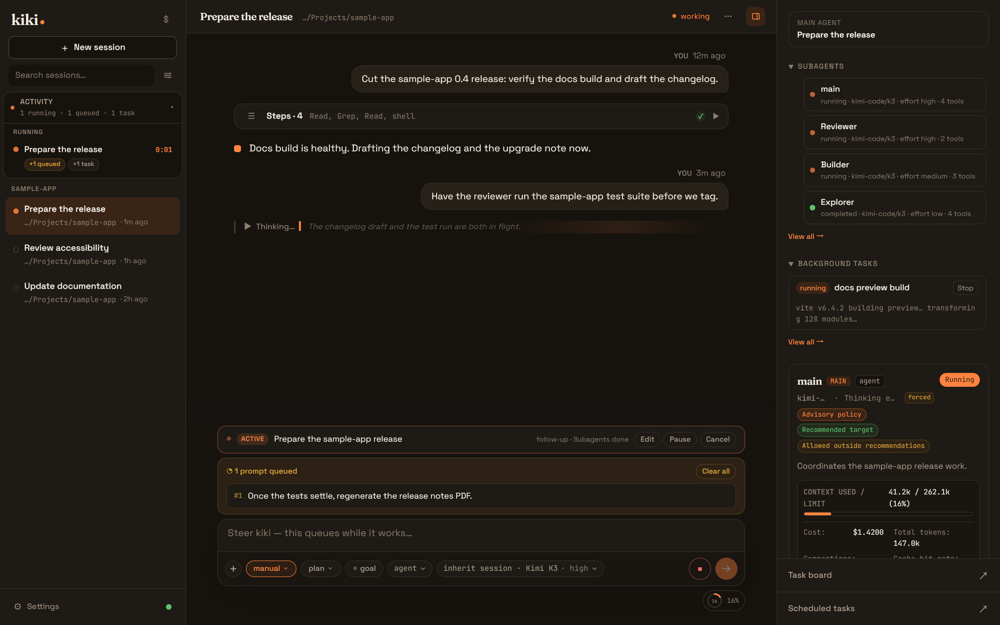
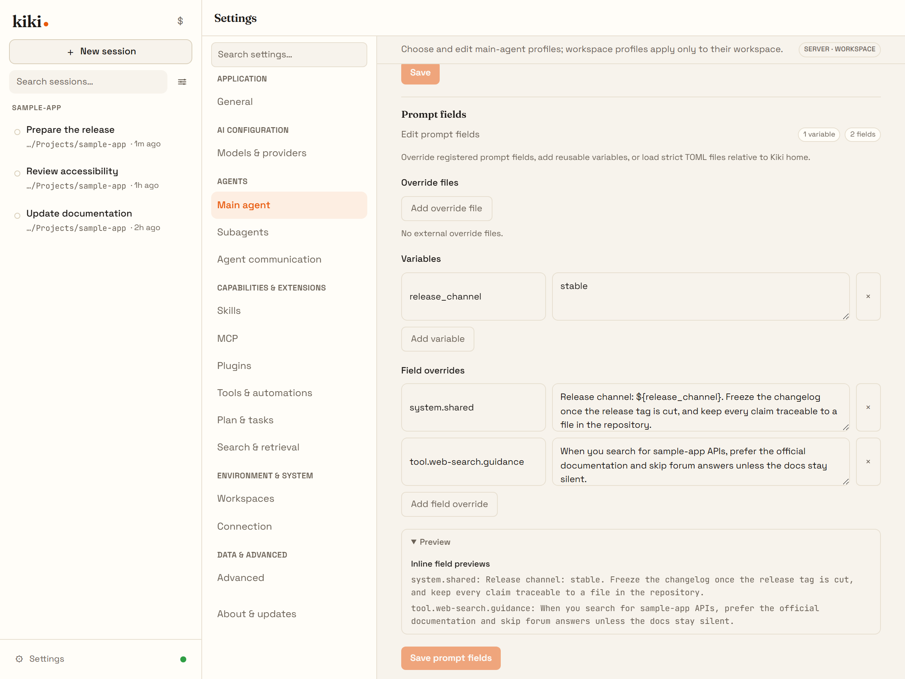
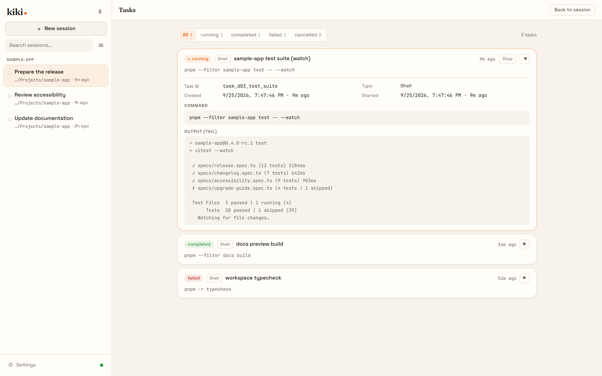
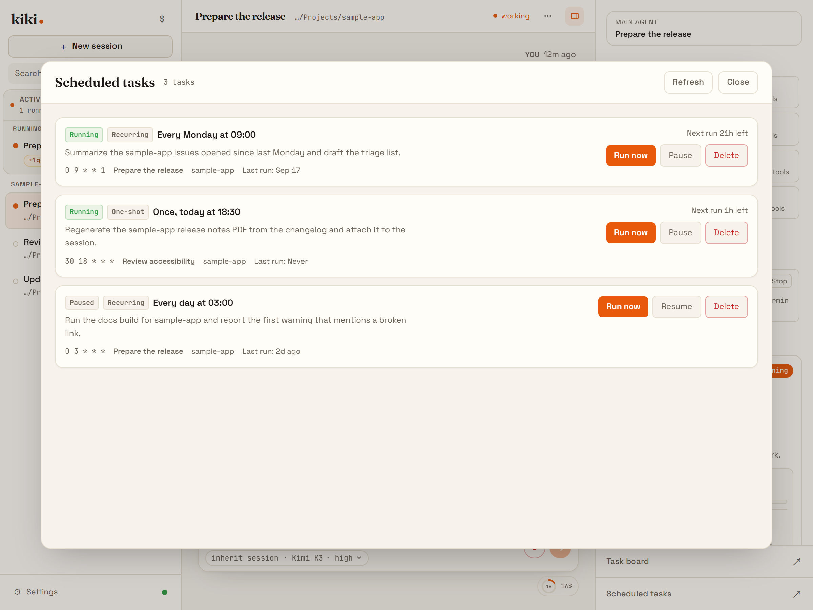
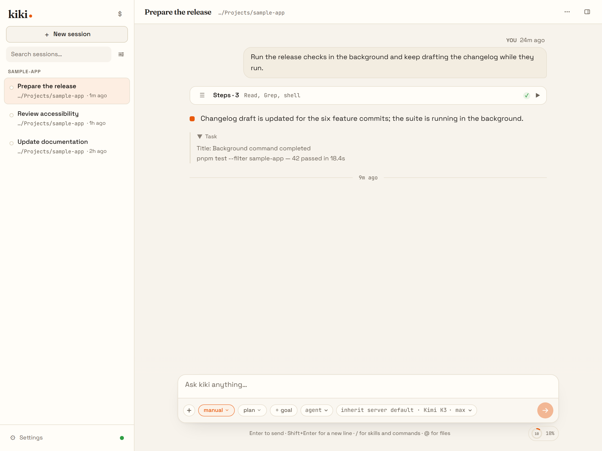
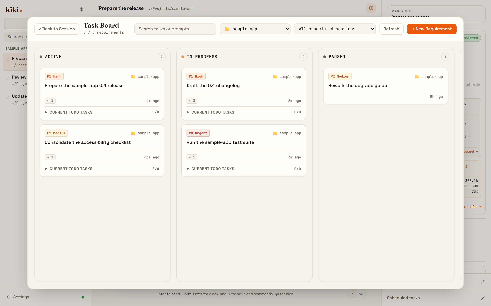
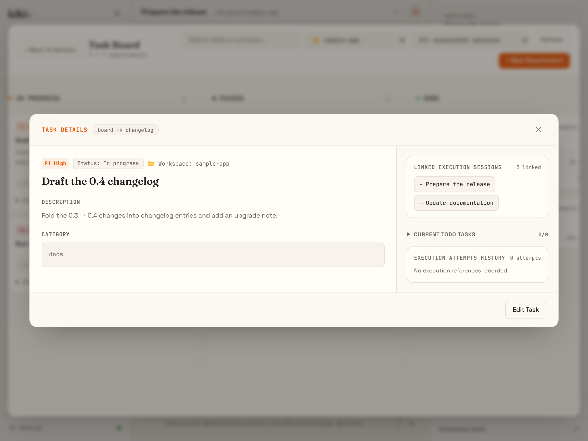
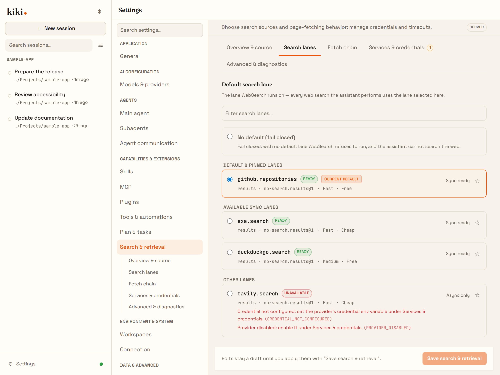
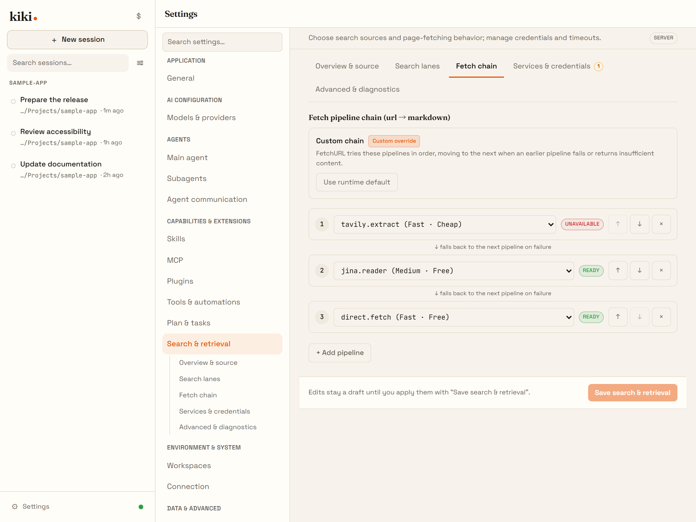
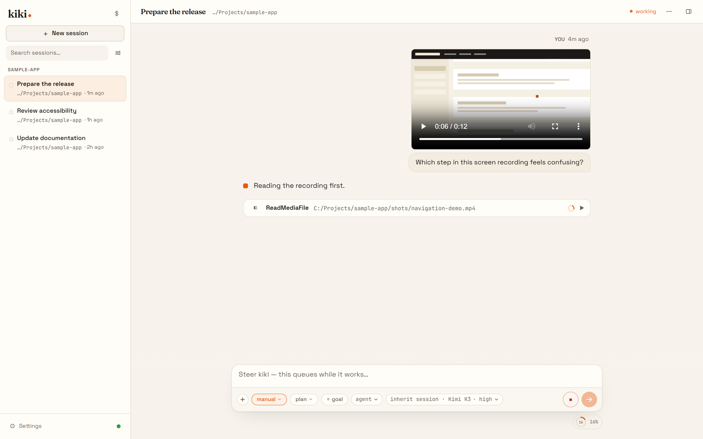

# Kiki screenshot tour

*All scenes below are rendered by the real Kiki UI on an example project.*

## The workbench

One window, the whole fleet: sessions on the left, the working transcript in the center, the live dispatch tree on the right, and a goal with a queued message at the bottom.

The same workbench in dark theme:

## Own the agent

Every agent is a Markdown file. In Settings you can read and edit the raw profile — source path, frontmatter bindings, system prompt and all.

Every built-in prompt is overridable field by field, with a live preview of what the model will see.

## Run the fleet

Pin a goal the agent pursues across turns, and queue follow-up messages with per-message timing while it works.

Long-running work detaches into background tasks with status, output, and a stop switch.

Scheduled tasks fire prompts into sessions on a cron schedule — inspectable, pausable, triggerable by hand.

## See everything

Open any dispatched agent to read its own transcript: what it was asked, what it did, what it concluded.

Tool steps fold away; completion notices stay on the timeline where you can check them.

## Task board

Each workspace has a kanban board where requirements live as first-class objects, linked to the sessions working on them.

From a card to the session doing the work, in one click.

## Web access, with real key management

Search and fetch run on named lanes you can inspect — keyless defaults included.

Fetch extraction chains fall through visibly when one extractor fails.

## Video input

Drop a screen recording into the chat; the agent watches it with you.

