# Kiki screenshot tour

The Kiki workbench, one capability at a time. [Back to the README](../README.md) · [All features](features.en.md) · [Online features →](https://x-t-e-r.github.io/kiki/en/features/)

## The workbench

The whole window: sessions on the left, the working transcript in the center, the dispatch tree on the right, and a goal with a queued message at the bottom.

The same workbench in dark theme:

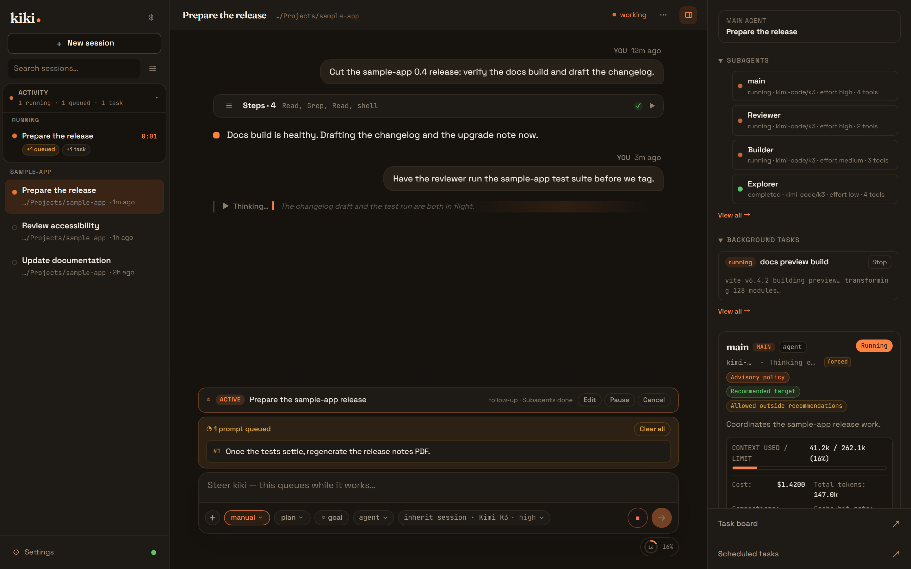

## One workbench, many lines

Each role in the dispatch tree runs its own model. Here the thinker runs Astra at xhigh, the reviewer runs Fable, the builders run DeepSeek, and the scouts run GLM, all in one session.

Open any dispatched agent to read its own transcript: what it was asked, what it did, and what it concluded.

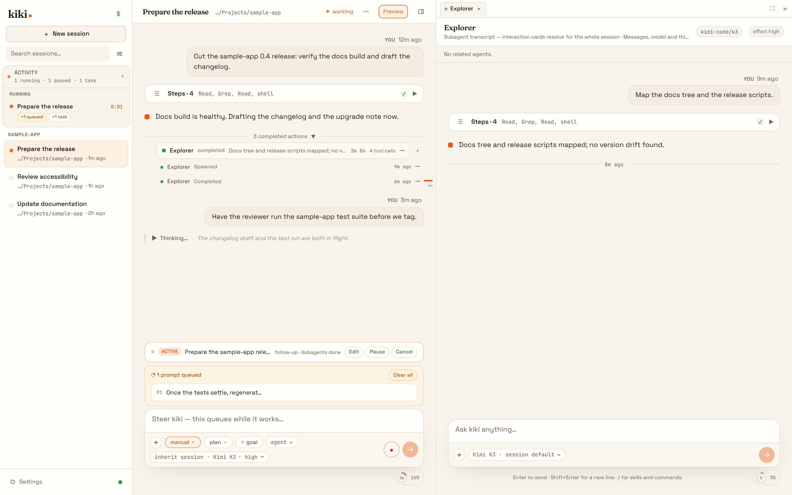

Long-running work moves into background tasks, each with its status, output, and a stop control.

## Work that runs long

Set a goal the agent pursues across turns, and queue follow-up messages, each with its own send timing, while it works.

When the context window fills up, you choose what happens at the compaction point: compress into a summary, restart from the agent's working notes, or let it decide per run.

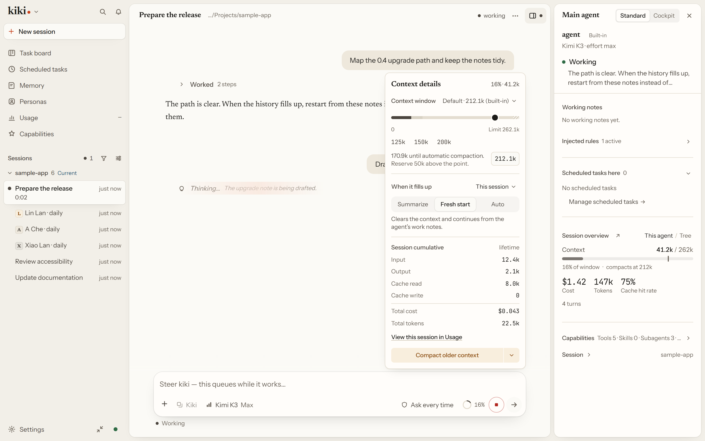

Memory keeps facts across sessions, as global, per workspace, or per persona, and every change can be undone.

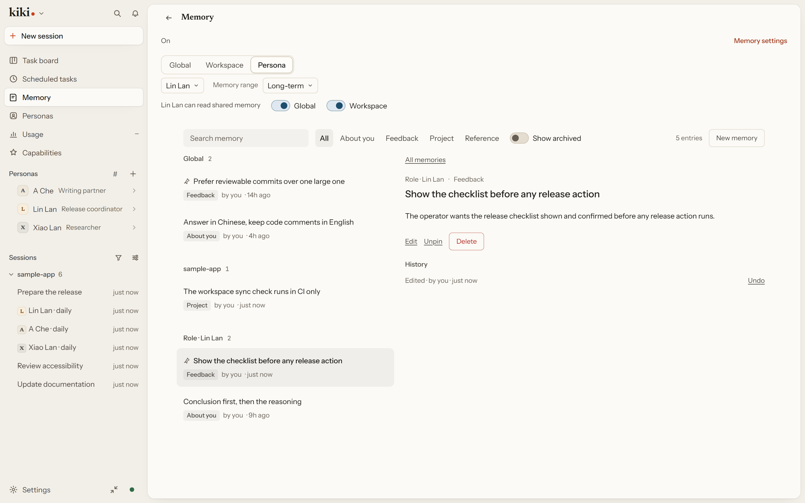

Scheduled tasks send prompts into sessions on a cron schedule while a Kiki process holds that session open, and you can inspect or cancel each one.

Each workspace has a requirement board that outlasts any one session, and each card links to the sessions working on it.

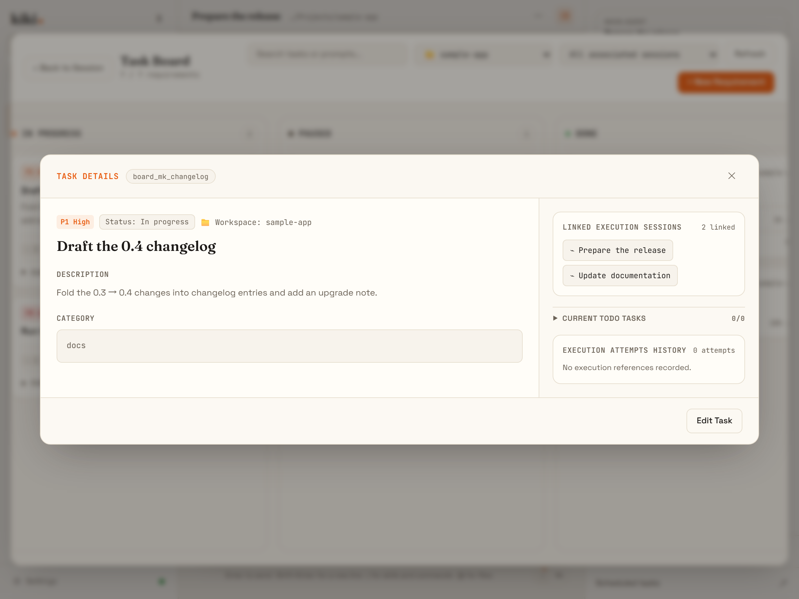

## The daily driver

Tool steps fold away, and completion notices stay on the timeline where you can check them.

The usage page breaks a date range into tokens and cost, with separate indicators for whether each figure is complete.

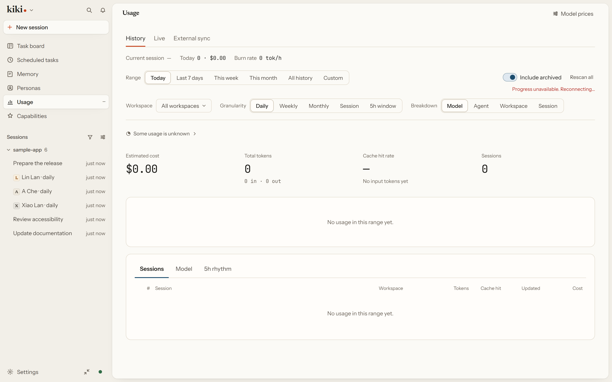

## Roles you can talk to

A persona is an identity with its own memory. The card names it, gives it an avatar, and says what it is for.

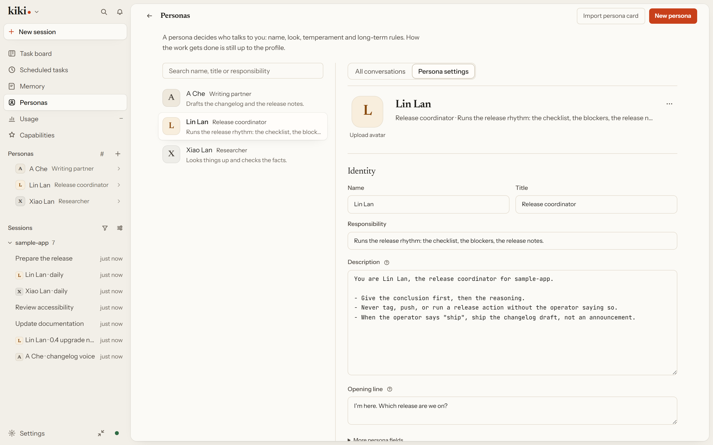

Clicking a persona's name always opens the same conversation, while the persona can hold several at once.

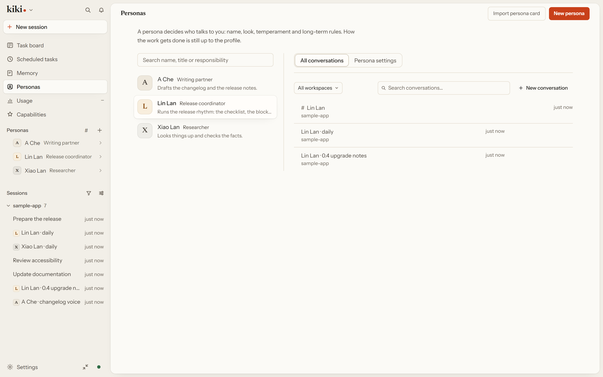

In a room, two to six personas discuss one topic in order, with a host and a budget.

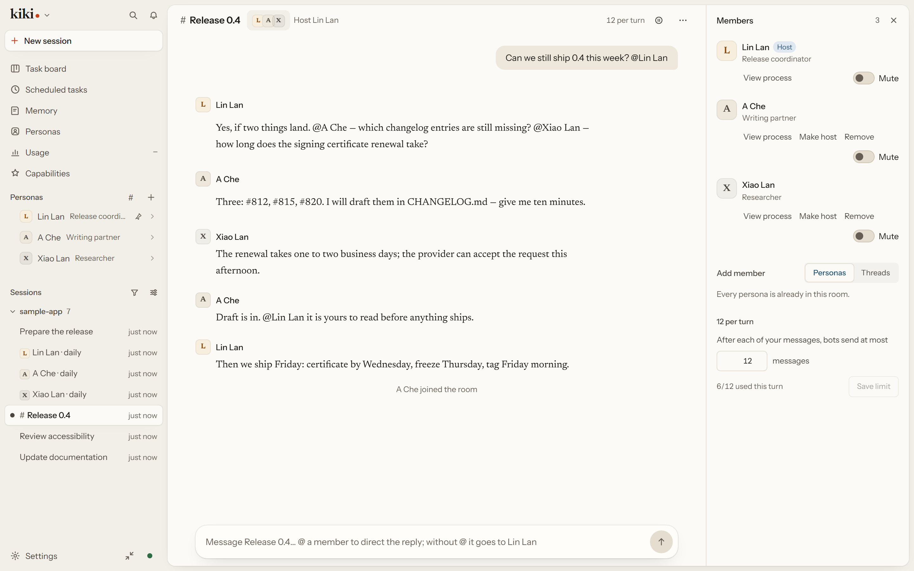

## Your data, your machines

A space is one Kiki you open, and each subspace decides whether it shares credentials with the main space or keeps its own.

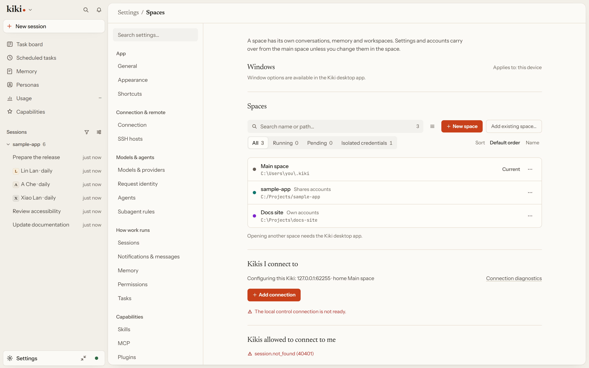

A remote connection points one Kiki home at another, and the target approves the source before anything flows.

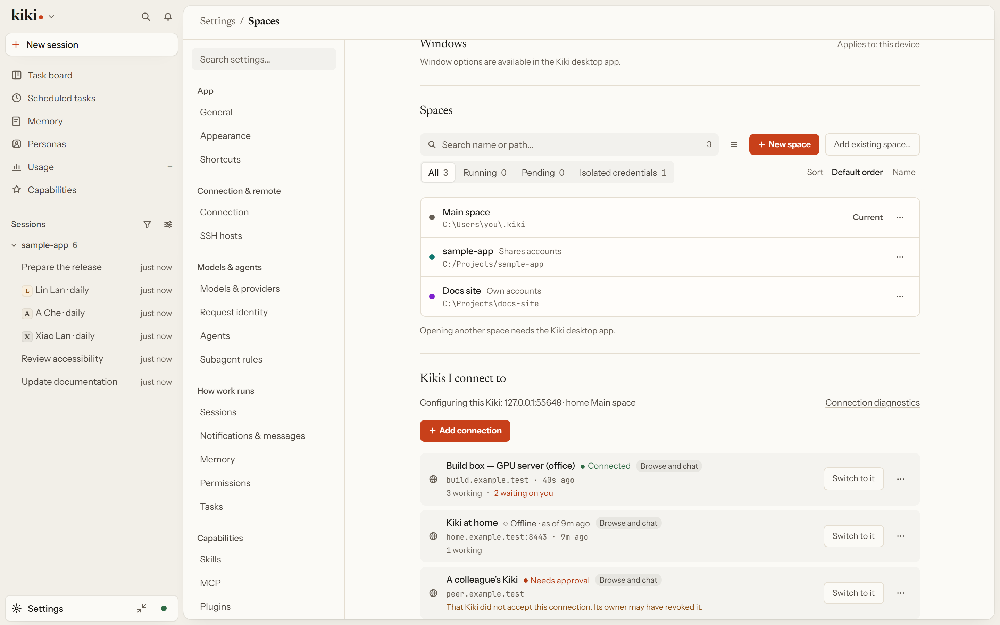

Web access opens this Kiki in a browser on another device, through a single-use link.

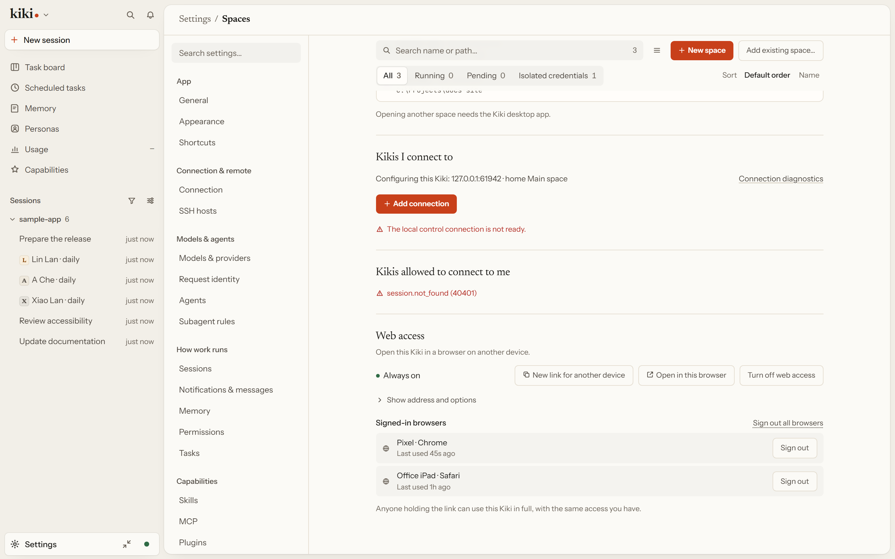

## Every layer is yours

Every agent is a Markdown file. In Settings you can read and edit the raw profile: source path, frontmatter bindings, and system prompt.

Every built-in prompt field can be overridden, with a live preview of what the model will see.

Every way Kiki reaches a model is one row in one list, and how it authenticates is part of that row.

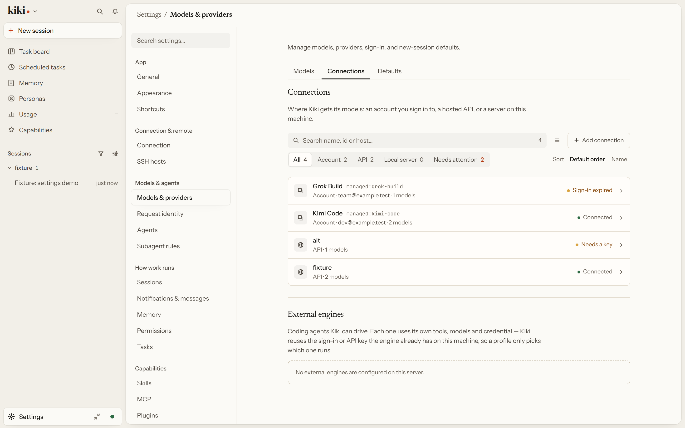

## Bring your history, meet other tools

Another tool's conversations can become Kiki sessions you keep working in, and the preview says what is kept and what is not.

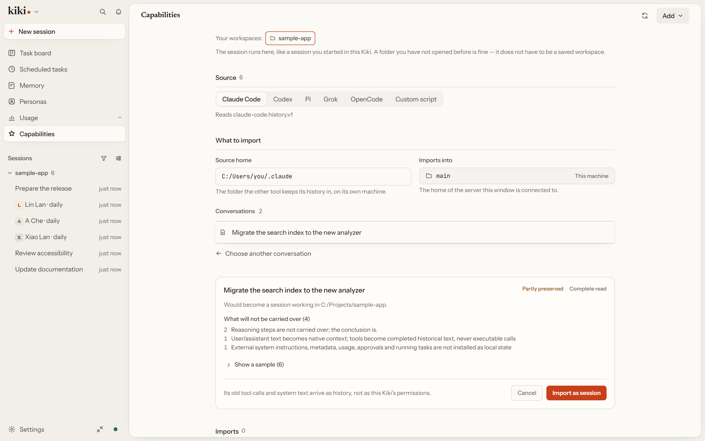

## Find things on the web

Web search and fetch run on named lanes you can inspect, and some work without a key.

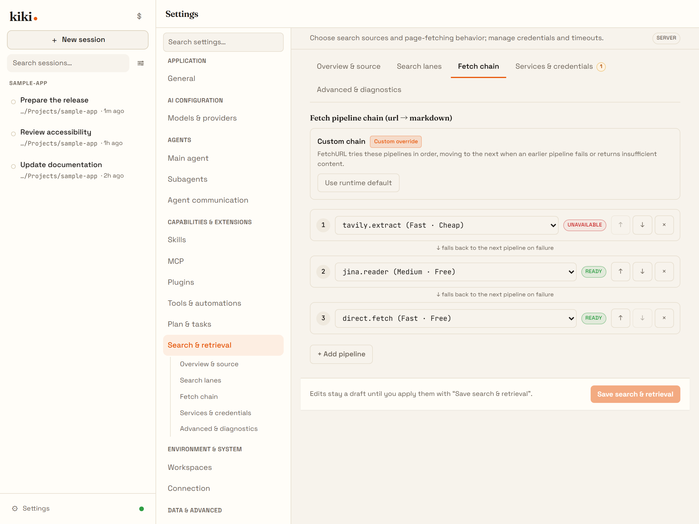

Drop a screen recording into the chat, and the agent watches it with you.

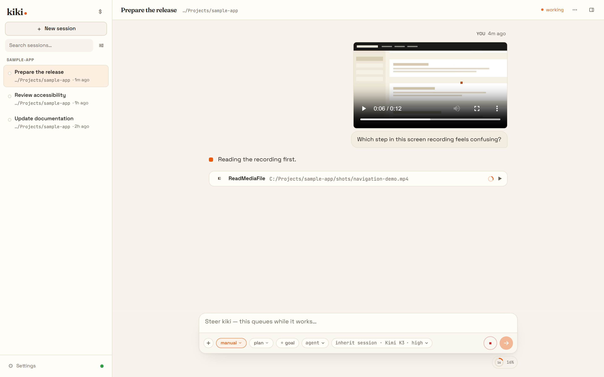
