# Kiki 截图巡览

*以下场景均由真实 Kiki 界面在示例项目上渲染。*

## 工作台

一扇窗，整支机队：左侧会话列表，中央工作中的对话，右侧实时派发树，底部是进行中的目标和排队消息。

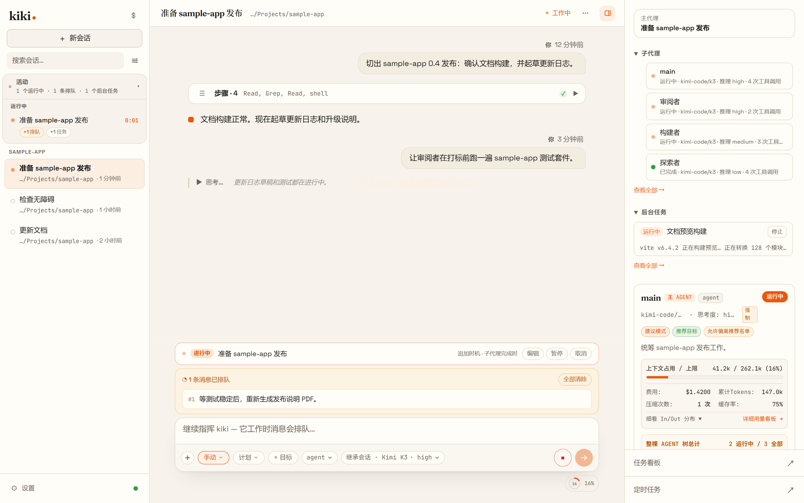

## 拥有你的 agent

每个 agent 都是一份 Markdown 文件。在设置里可以直接读写 profile 原文——来源路径、frontmatter 绑定、系统提示词，一览无余。

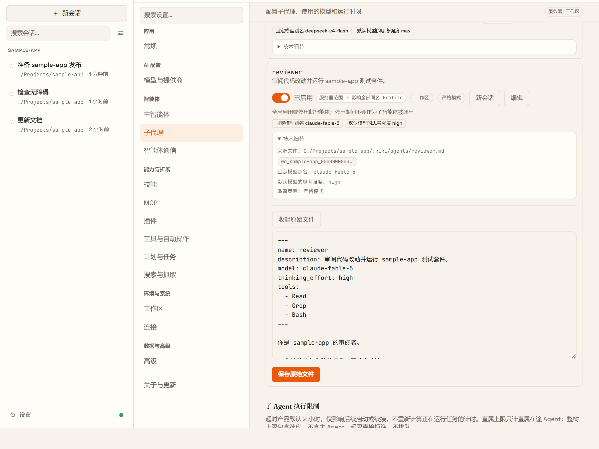

所有内置提示词都可以按字段覆写，预览实时显示模型将看到的内容。

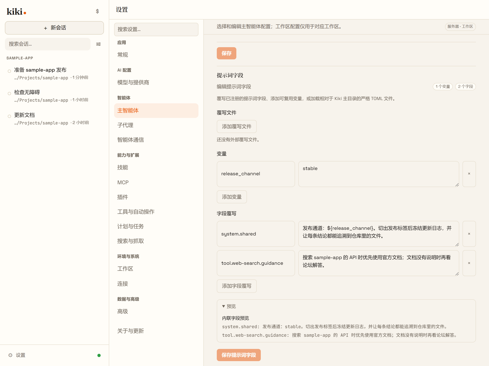

## 指挥你的机队

一支机队，五种模型：思考用 Astra xhigh、审阅用 Fable、执行用 DeepSeek、探查用 GLM——每个角色绑定最合适的模型。

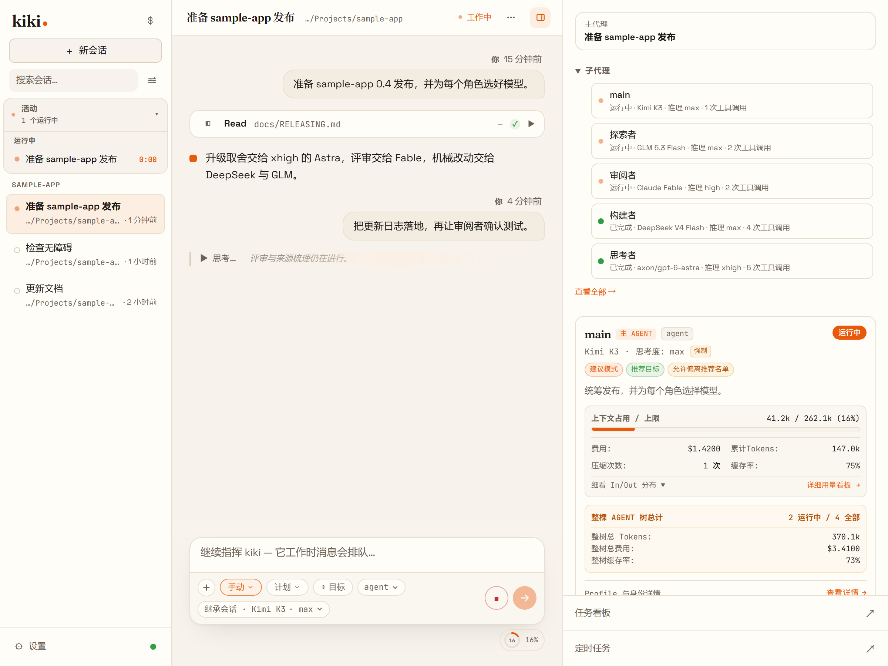

锁定一个跨轮持续推进的目标；agent 忙碌时，后续消息排队并逐条调整时机。

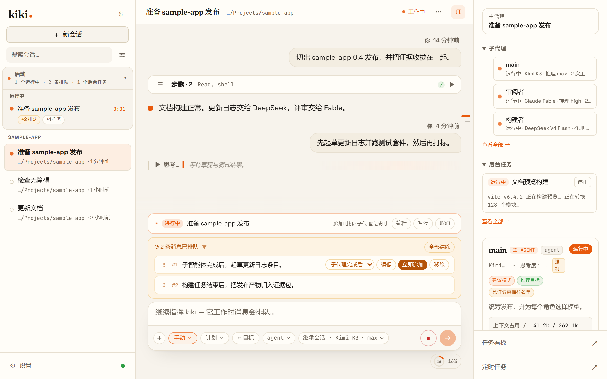

耗时工作转为后台任务：状态、输出、停止开关都在。

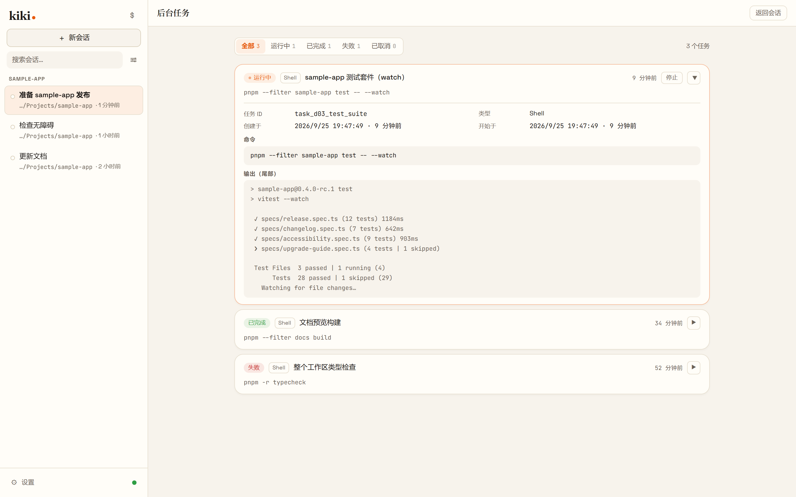

定时任务按 cron 计划把 prompt 注入会话——可查看、可暂停、可手动触发。

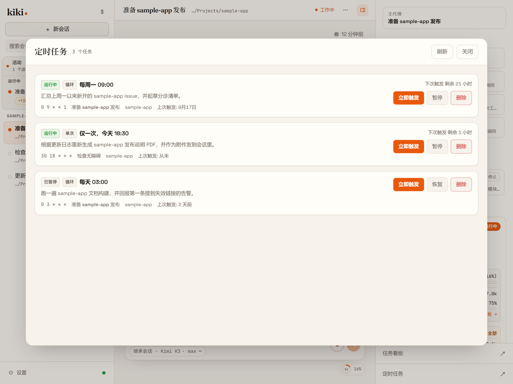

## 看见一切

打开任何一个派出的 agent，读它自己的会话记录：它收到了什么、做了什么、得出了什么结论。

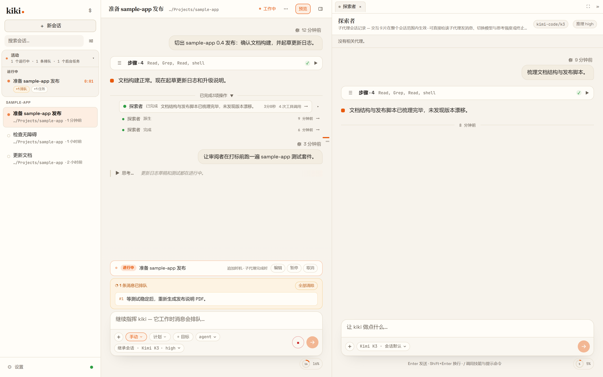

工具步骤折叠收拢，完成通知留在时间线上随时可查。

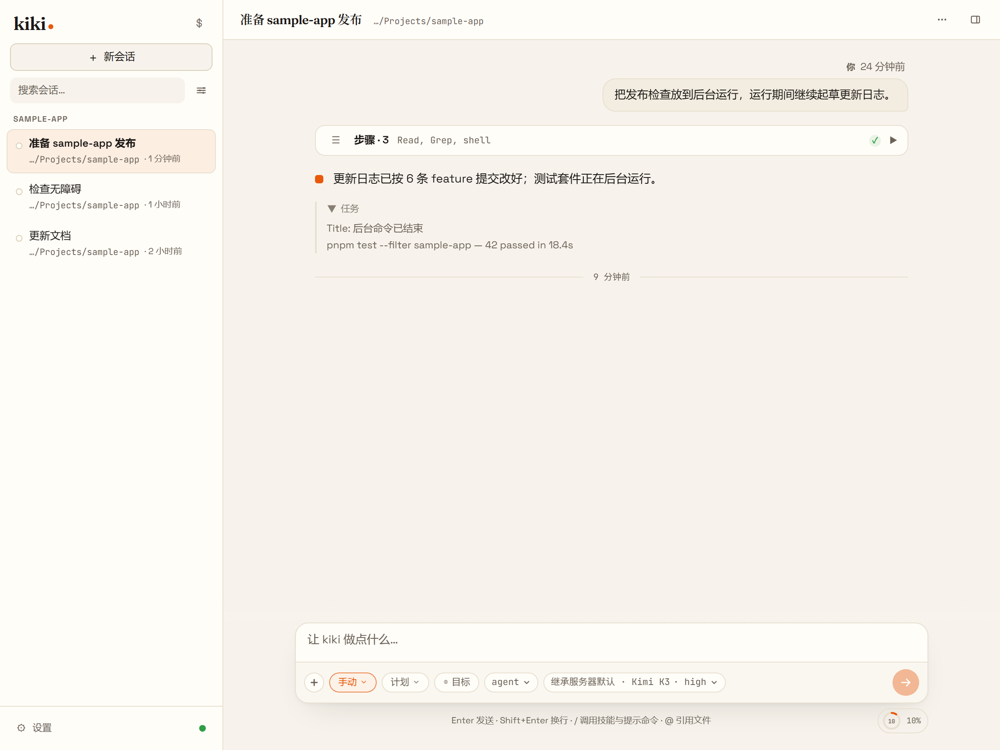

## 任务看板

每个工作区都有一块看板，需求是一等公民的对象，并关联到处理它们的会话。

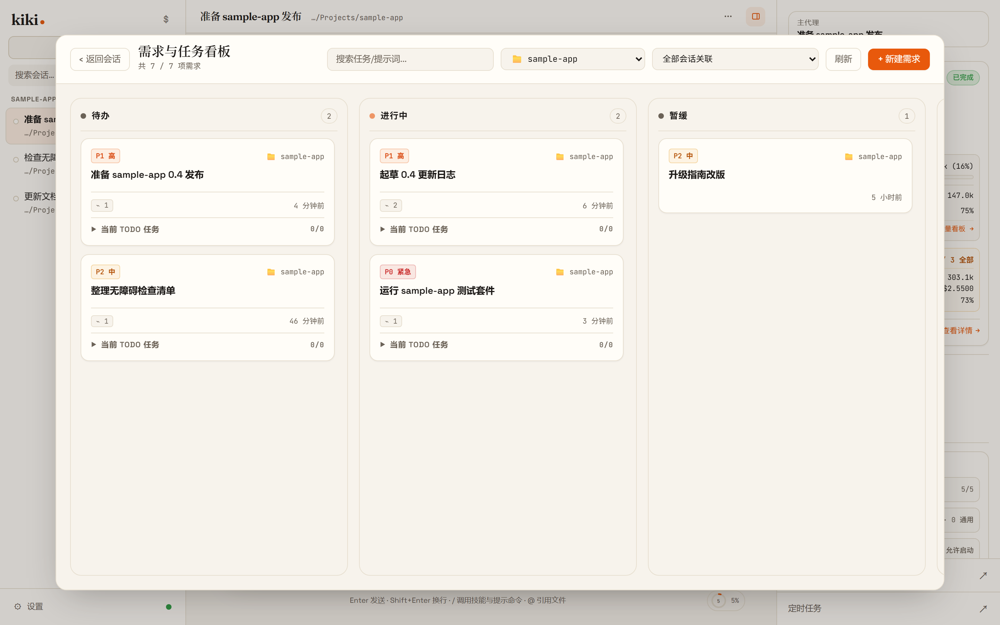

从卡片到正在干活的会话，一键直达。

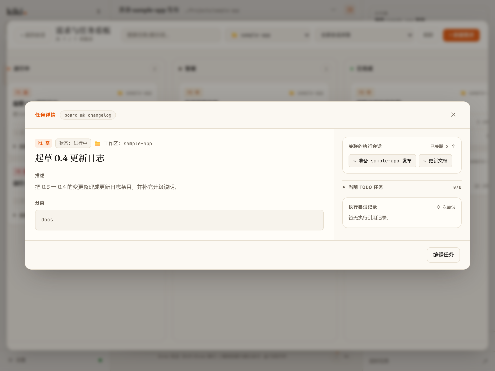

## 联网，带真钥匙管理

搜索和抓取跑在可检查的命名通道上——免密默认开箱即用。

抓取链在某个提取器失败时可见地回退到下一条。

## 视频输入

把屏幕录像拖进对话，agent 和你一起看。

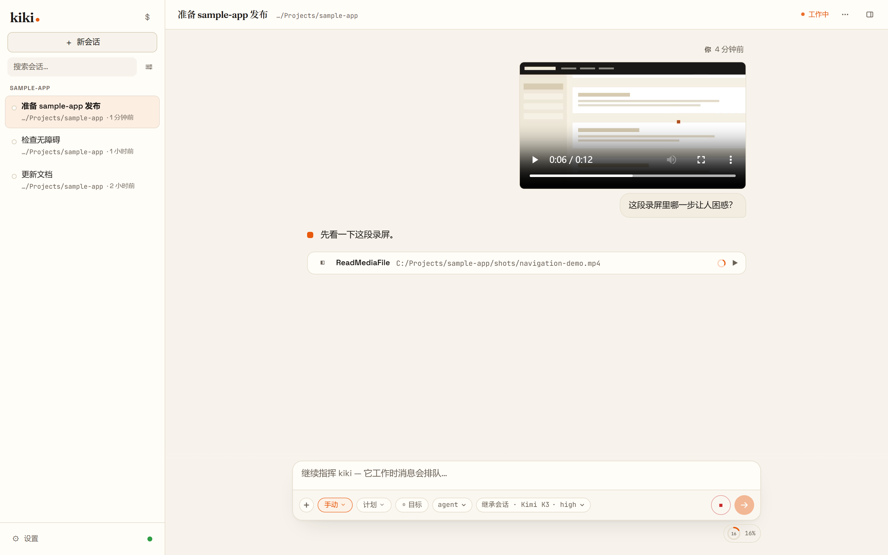
