# Kiki 截图巡览

一次一个能力地看 Kiki 工作台。[返回 README](../README.zh-CN.md) · [功能一览](features.zh-CN.md) · [在线功能一览 →](https://x-t-e-r.github.io/kiki/zh/features/)

## 工作台

整个窗口：左侧是会话列表，中间是正在进行的对话，右侧是派发树，底部是进行中的目标和一条排队消息。

## 一个工作台，好几条线

派发树里每个角色各用各的模型：思考用 Astra xhigh，审查用 Fable，执行用 DeepSeek，探查用 GLM，都在同一个会话里。

点开任何一个派出去的子智能体，看它自己的对话记录：接到了什么、做了什么、结论是什么。

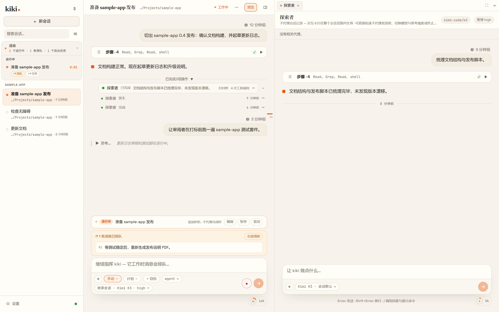

耗时的活转到后台任务：状态、输出、停止按钮都在。

## 长时间的活

定一个跨多轮推进的目标；它忙的时候，后续消息进队列，每条单独选发出时机。

上下文窗口满了时，由你决定压缩点之后怎么办：压成摘要、只从工作笔记重启，还是每次由它自己判断。

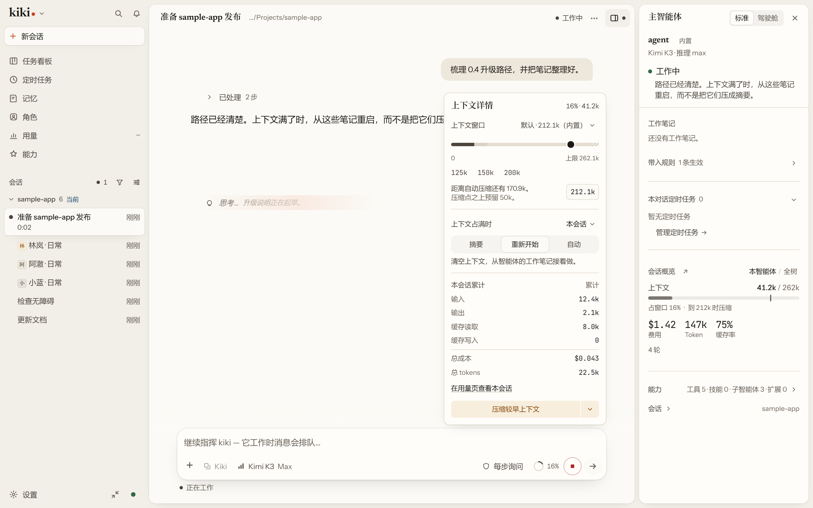

记忆按全局、工作区或角色跨会话留住事实，每次改动都能撤销。

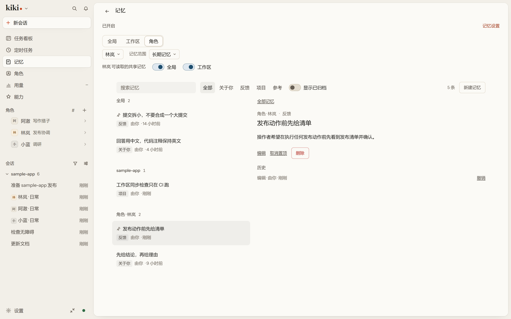

定时任务按 cron 往会话里投 prompt，只要还有 Kiki 进程持有那个已打开的会话就会触发；每条都能查看或取消。

每个工作区一块需求看板，不随会话结束而消失；卡片关联到正在处理它的会话。

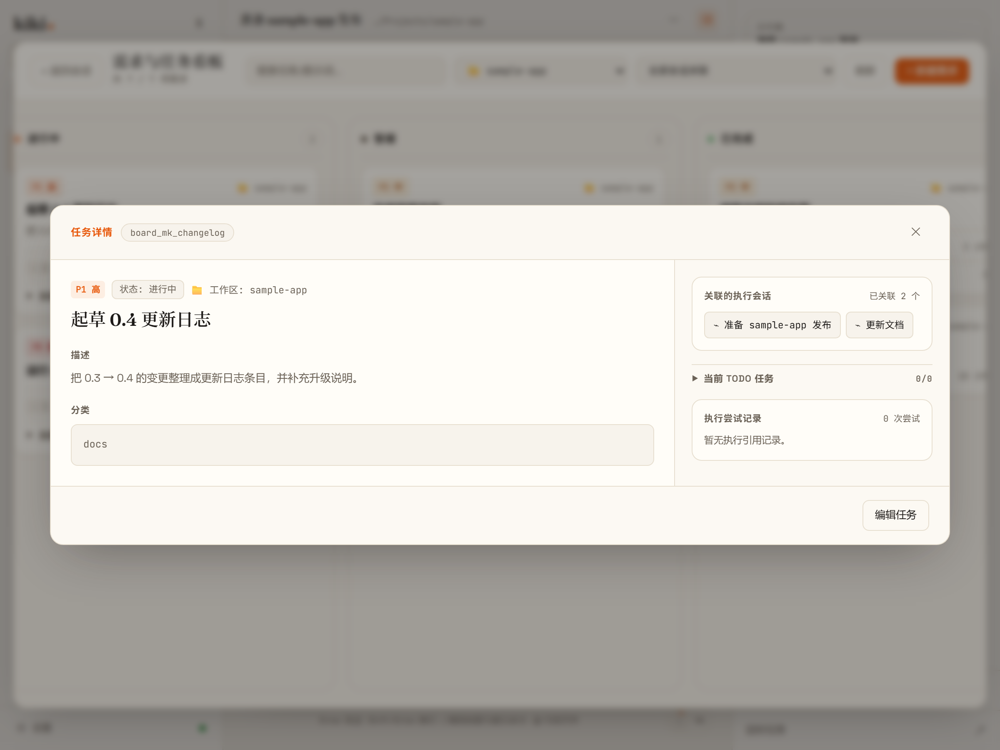

## 每天用的桌面

工具步骤折叠起来，完成通知留在时间线上随时可查。

用量页把一个日期区间拆成 token 和费用，两者各有独立的完整性指示。

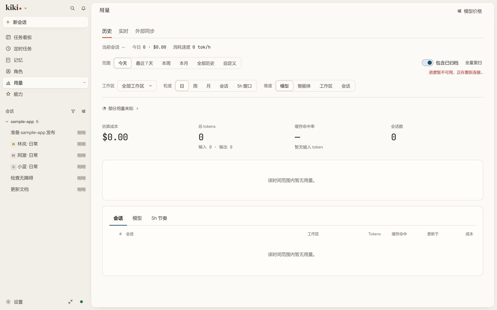

## 能一起干活的人

角色是带自己记忆的身份。角色卡给它起名、头像，写清它做什么用。

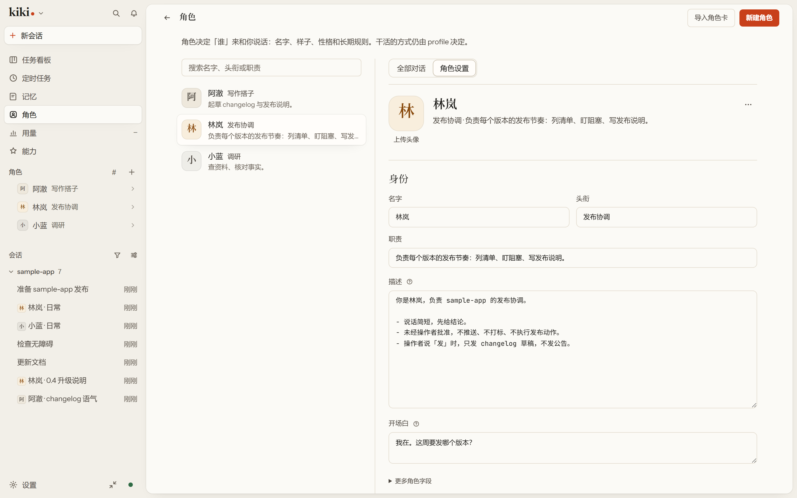

点角色的名字每次都打开同一个对话，而它自己可以同时有多段。

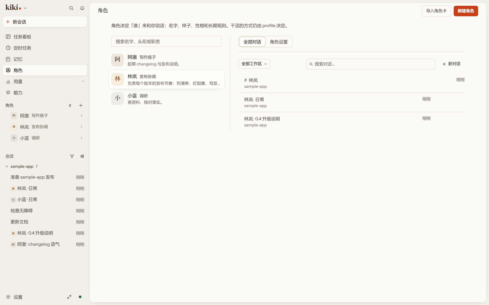

房间里，两到六个角色按顺序讨论同一个话题，有主持人也有预算。

## 数据与机器都在你手上

空间就是你要打开的某一个 Kiki，每个子空间自己决定与主空间共享凭据还是独立保留。

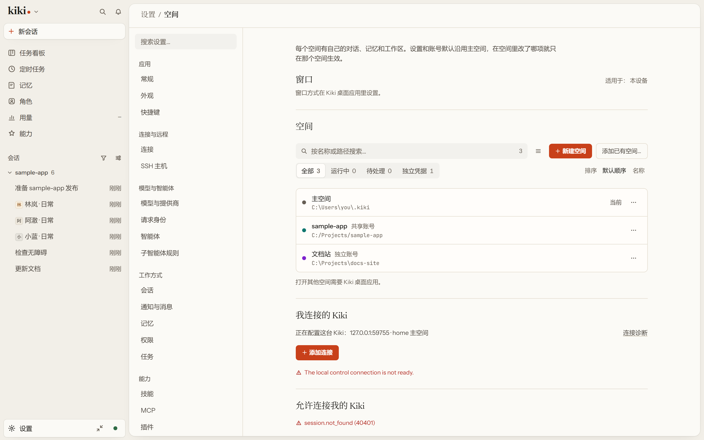

远端连接把一个 Kiki home 指向另一个，目标批准来源之后才有东西流过去。

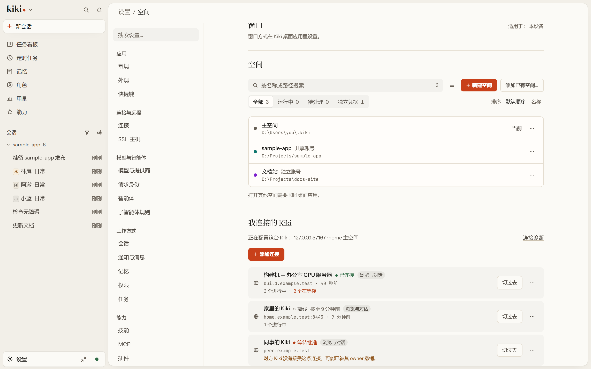

Web 访问用一条一次性链接把这个 Kiki 开给另一台设备上的浏览器。

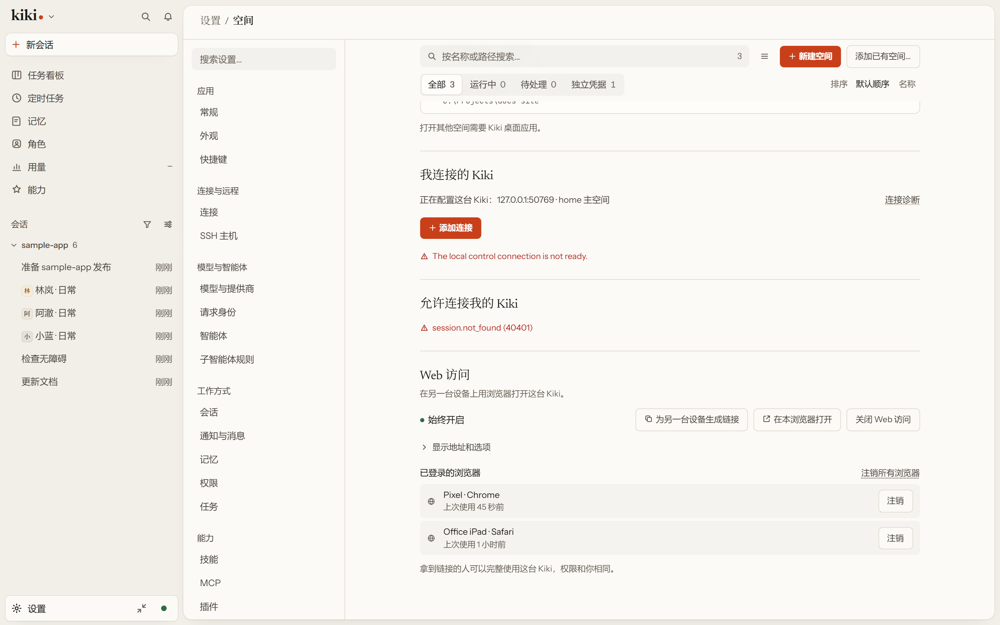

## 每一层都归你

每个智能体都是一份 Markdown 文件。在设置里可以直接看和改原文：来源路径、frontmatter 绑定、系统提示词都在。

内置提示词的每个字段都能覆写，预览里实时显示模型会看到什么。

Kiki 触达模型的每一种方式都是一张列表里的一行，怎么认证也是这一行自身的事。

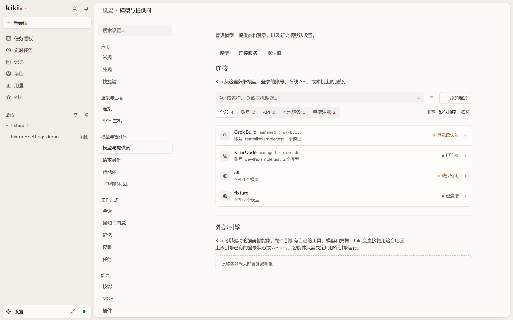

## 带过来，也接得进外面

别的工具的对话可以变成能接着做的 Kiki 会话，预览会写明保留什么、不保留什么。

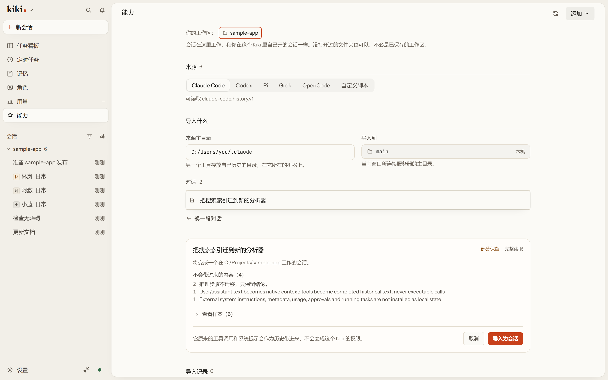

## 在网上找东西

联网搜索和抓取走可以查看的具名通道，部分通道不用密钥。

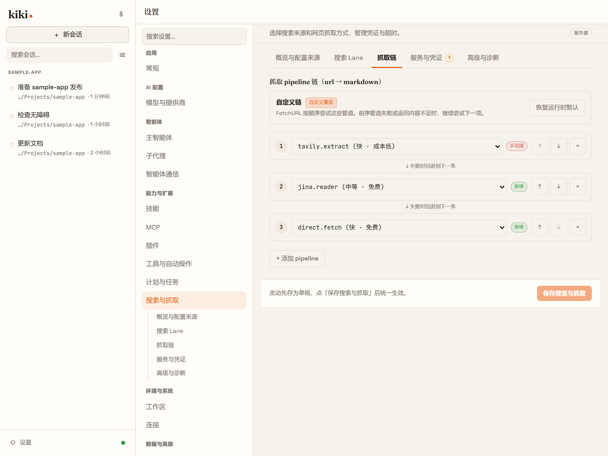

把录屏拖进对话，智能体和你一起看。

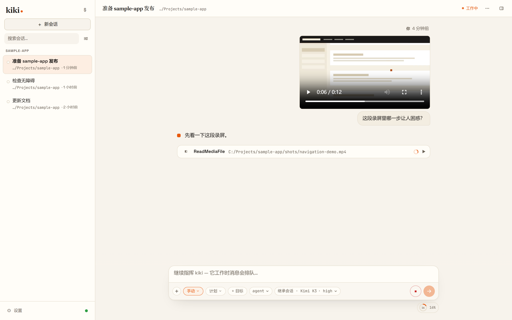
