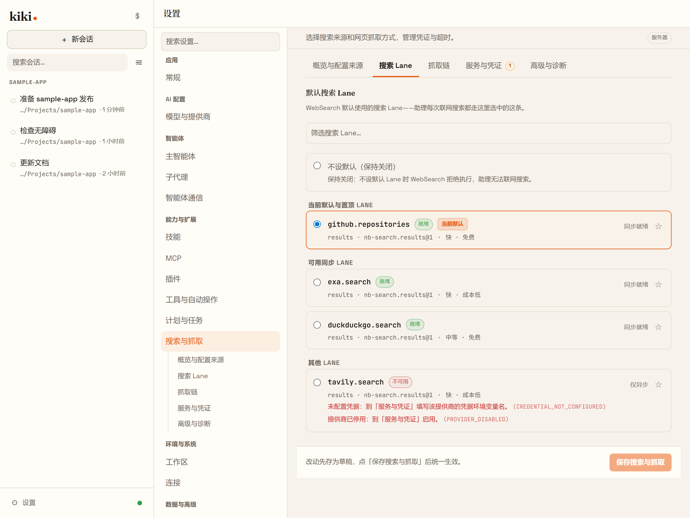
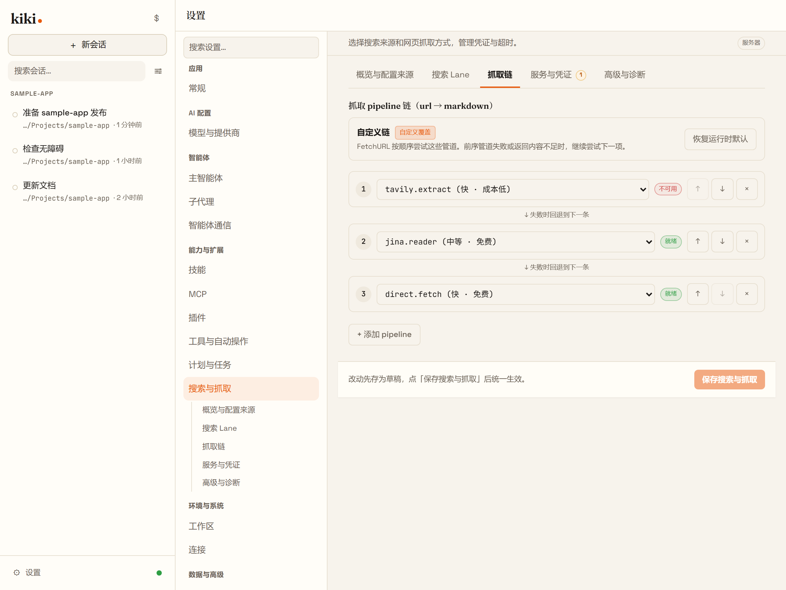

# 特色聚焦：nb-search —— 带真钥匙管理的联网能力

*Kiki 特色宣传页。*

每个编码 agent 都"能联网"。但大多数止步于把单个 API key 塞进环境变量，一旦这把 key 限流就整个趴窝。Kiki 的联网能力跑在 **nb-search** 上——一个与 Kiki 同步开发、深度集成的独立搜索/抓取库，直接支撑 Kiki 的 `WebSearch` / `FetchURL` 工具。

## 通道（lane），而不是单一端点

nb-search 把联网组织成命名的**通道**——`tavily.search`、`exa.search`、`duckduckgo.search`、`github.repositories`、`context7.docs` 等等——每条通道有自己的供应商、成本和延迟特征。agent 按查询选择通道，也可以多通道并发，拿回带溯源信息的去重结果。抓取侧同理：提取链（如 `tavily.extract → jina.reader → direct.fetch`）在某个提取器失败或返回垃圾时自动回落。

## 零配置开箱即用

有两条通道完全不需要凭证：**GitHub 仓库搜索**和 **Context7 库文档**。全新的 Kiki 安装在你什么都没配之前，就已经能回答"X 现在的 API 长什么样"和"帮我找个能做 Y 的仓库"。

## 多 key，带调度器

当你真的配置供应商时，nb-search 是认真的：

- **每个供应商多把 key**——本地凭证文件里逗号分隔，而不是只有孤零零一个环境变量。
- **调度策略**——key 之间轮转（round-robin）或优先级排序，某把 key 报错或限流时自动冷却。
- **重试与故障转移**——一把 key 失败不等于查询失败，调度器直接换下一把。
- **余额感知**——对开放了用量查询的供应商，nb-search 按缓存节奏查询余额，让调度优先用余量充足的 key，又不会在每次调用前白白多付一次额度查询。

## 为什么重要

搜索是 agent 调用最多、也最不被注意的工具——直到凌晨两点它因为一把免费 key 耗尽而毁掉一个跑了两小时的会话。nb-search 把联网从单点故障变成可管理的基础设施：可检查的通道、会轮转的 key、能自我绕开的故障。
